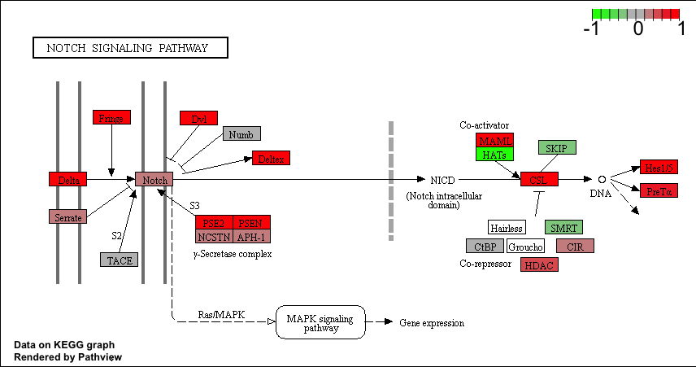

```{r setup, include=FALSE}
knitr::opts_chunk$set(echo = TRUE)
```

##Pathway Analysis from RNA-Seq Results

Section 1. Differential Expression Analysis

```{r}
metafile <- read.csv("GSE37704_metadata.csv", row.names = 1)
countfile <- read.csv("GSE37704_featurecounts.csv", row.names = 1)
library(DESeq2)
```

```{r}
countdata <- countfile[,-1]
head(countdata)
```

```{r}
# Filter count data where you have 0 read count across all samples.
countData <- countdata[rowSums(countdata)!=0, ]
head(countData)
nrow(countData)
```

```{r}
dds = DESeqDataSetFromMatrix(countData=countData,
                             colData=metafile,
                             design=~condition)
dds = DESeq(dds)
dds
```

```{r}
res <- results(dds)
res
```

```{r}
summary(res)
```

Volcano plot
```{r}
plot( res$log2FoldChange, -log(res$padj) )

# Make a color vector for all genes
mycols <- rep("gray", nrow(res) )

# Color red the genes with absolute fold change above 2
mycols[ abs(res$log2FoldChange) > 2 ] <- "red"

# Color blue those with adjusted p-value less than 0.01
#  and absolute fold change more than 2
inds <- (res$padj<0.01) & (abs(res$log2FoldChange) > 2 )
mycols[ inds ] <- "blue"

plot( res$log2FoldChange, -log(res$padj), col=mycols, xlab="Log2(FoldChange)", ylab="-Log(P-value)" )
```

Adding gene annotation
```{r}
library("AnnotationDbi")
library("org.Hs.eg.db")

columns(org.Hs.eg.db)

```

```{r}

res$symbol = mapIds(org.Hs.eg.db,
                    keys=row.names(res), 
                    keytype="ENSEMBL",
                    column="SYMBOL",
                    multiVals="first")

res$entrez = mapIds(org.Hs.eg.db,
                    keys=row.names(res),
                    keytype="ENSEMBL",
                    column="ENTREZID",
                    multiVals="first")

res$name =   mapIds(org.Hs.eg.db,
                    keys=row.names(res),
                    keytype="ENSEMBL",
                    column="GENENAME",
                    multiVals="first")

head(res, 10)
```

```{r}
res = res[order(res$pvalue),]
write.csv(res, file="deseq_results.csv")
```

Section 2. Pathway Analysis
KEGG pathways analysis
```{r}
library(pathview)
library(gage)
library(gageData)

data(kegg.sets.hs)
data(sigmet.idx.hs)
```

```{r}
# Focus on signaling and metabolic pathways only
kegg.sets.hs = kegg.sets.hs[sigmet.idx.hs]

# Examine the first 3 pathways
head(kegg.sets.hs, 3)
```

```{r}
foldchanges = res$log2FoldChange
names(foldchanges) = res$entrez
head(foldchanges)
```

```{r}
# Get the results
keggres = gage(foldchanges, gsets=kegg.sets.hs)
```

```{r}
attributes(keggres)
```

```{r}
head(keggres$less)
```

```{r}
pathview(gene.data=foldchanges, pathway.id="hsa04110")
```


```{r}
head(keggres$greater)
# Focus on top 5 upregulated pathways here for demo purposes only
keggresuppathway <- rownames(keggres$greater[1:5,])
# Extract the 8 character long IDs part of each string
keggresids = substr(keggresuppathway, start=1, stop=8)
keggresids
```

```{r}
pathview(gene.data=foldchanges, pathway.id=keggresids, species="hsa")
```




Section 3. Gene Ontology (GO)
```{r}
data(go.sets.hs)
data(go.subs.hs)

# Focus on Biological Process subset of GO
gobpsets = go.sets.hs[go.subs.hs$BP]

gobpres = gage(foldchanges, gsets=gobpsets, same.dir=TRUE)

lapply(gobpres, head)
```

Section 4. Reactome Analysis
```{r}
sig_genes <- res[res$padj <= 0.05 & !is.na(res$padj), "symbol"]
print(paste("Total number of significant genes:", length(sig_genes)))
write.table(sig_genes, file="significant_genes.txt", row.names=FALSE, col.names=FALSE, quote=FALSE)
```

```{r}

```

