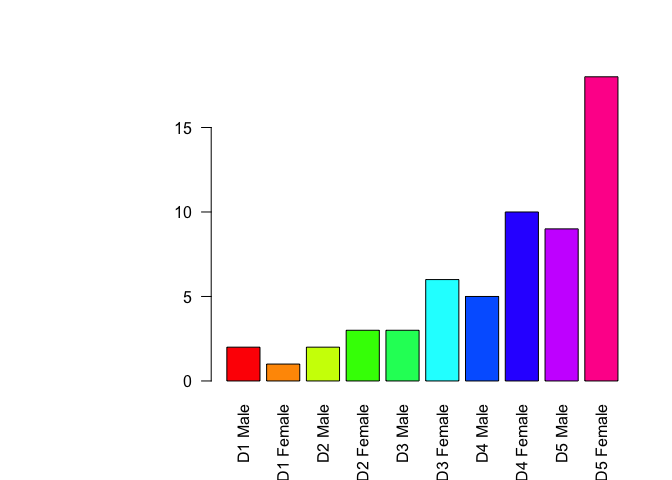
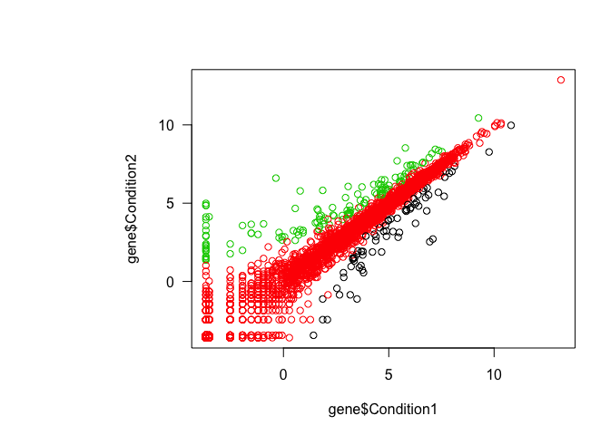

BGGN213\_Class5
================
Yutao Wen
6/6/2019

``` r
#' ---
#' title: "BGGN213 SP19 Class5: R Graphics"
#' author: "Yutao Wen"
#' date: "Fri Apr 19 13:25:41 2019"
#' ---

# Class 5 R Graphics and plots

# Import data (weight vs age)
weight <- read.table("bimm143_05_rstats/weight_chart.txt", header=TRUE)

# Plot a scaterplot of age vs weight
plot(weight$Age, weight$Weight, type="o", pch=15, cex=1.5, lwd=2, ylim=c(2,10), xlab="Age (months)", ylab="Weight (kg)", main="Age vs Weight")
```


``` r
#Import data (feature counts) that's separated by tab
feature <- read.table("bimm143_05_rstats//feature_counts.txt", header = TRUE, sep = "\t")
# Note: can also use read.delim

# Plot a barplot of feature counts
par(las=1, mar=c(5,11,4,2))
barplot(feature$Count, horiz=TRUE, xlab="Counts", main="Counts by features", names.arg = feature$Feature)
```


``` r
# Histogram of random distribution
hist(c(rnorm(10000), rnorm(10000)+4), breaks = 80)
```


``` r
# Import data of counts by male/female
mf <- read.delim("bimm143_05_rstats/male_female_counts.txt", header = TRUE)

# Plot a barplot of it
barplot(mf$Count, names.arg = mf$Sample, col = rainbow(nrow(mf)), las=2)
```



``` r
barplot(mf$Count, names.arg = mf$Sample, col = c("blue2","red2"), las=2)
```


``` r
# Import data of gene expression
gene <- read.delim("bimm143_05_rstats/up_down_expression.txt", header = TRUE)

# Plot a scatterplot of it
table(gene$State)
```

    ## 
    ##       down unchanging         up 
    ##         72       4997        127

``` r
plot(gene$Condition1, gene$Condition2, col=gene$State)
```



``` r
palette()
```

    ## [1] "black"   "red"     "green3"  "blue"    "cyan"    "magenta" "yellow" 
    ## [8] "gray"

``` r
levels(gene$State)
```

    ## [1] "down"       "unchanging" "up"

``` r
palette(c("blue","gray","red"))
plot(gene$Condition1, gene$Condition2, col=gene$State, xlab = "Condition 1", ylab = "Condition 2")
```


``` r
# Import data of expression methylation
meth <- read.delim("bimm143_05_rstats/expression_methylation.txt", header = TRUE)
nrow(meth)
```

    ## [1] 9241

``` r
# Plot a scatterplot of it
pos <- meth$expression > 0
dcol <- densCols(meth$gene.meth[pos], meth$expression[pos])
plot(meth$gene.meth[pos], meth$expression[pos], col=dcol, pch=20)
```


``` r
dcol <- densCols(meth$gene.meth[pos], meth$expression[pos], colramp = colorRampPalette(c("blue2", "green2", "yellow2","red")))
plot(meth$gene.meth[pos], meth$expression[pos], col=dcol, pch=20)
```


