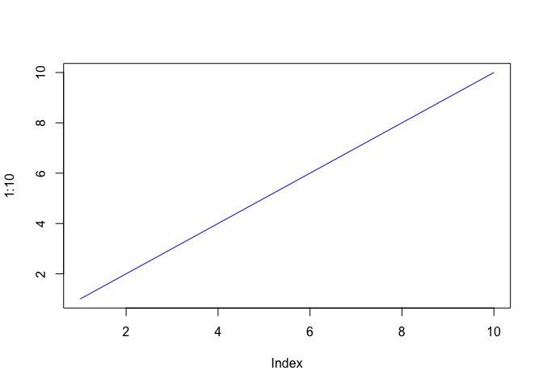
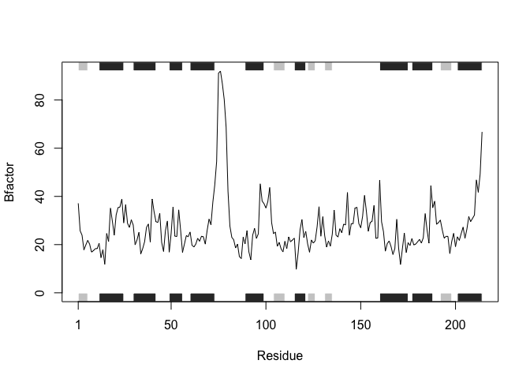

190419 Class6: R Functions
================
Yutao Wen
4/19/2019

Today we will focus on **R functions** but we will start with a bit of **file reading**.

``` r
plot(1:10, type="l", col="blue")
```



``` r
read.table("test1.txt", header = TRUE, sep=",")
```

    ##   Col1 Col2 Col3
    ## 1    1    2    3
    ## 2    4    5    6
    ## 3    7    8    9
    ## 4    a    b    c

Another file opening

``` r
read.table("test2.txt", header = TRUE, sep = "$")
```

    ##   Col1 Col2 Col3
    ## 1    1    2    3
    ## 2    4    5    6
    ## 3    7    8    9
    ## 4    a    b    c

``` r
read.table("test3.txt")
```

    ##   V1 V2 V3
    ## 1  1  6  a
    ## 2  2  7  b
    ## 3  3  8  c
    ## 4  4  9  d
    ## 5  5 10  e

``` r
read.csv("https://bioboot.github.io/bggn213_S19/class-material/test1.txt")
```

    ##   Col1 Col2 Col3
    ## 1    1    2    3
    ## 2    4    5    6
    ## 3    7    8    9
    ## 4    a    b    c

Our first function
------------------

Add some numbers

``` r
add <- function(x, y=1) {
    # The body
   x + y
}
```

``` r
add(x=4, y=5)
```

    ## [1] 9

``` r
add(4)
```

    ## [1] 5

``` r
add(c(1,3,5), 1)
```

    ## [1] 2 4 6

``` r
#add(1,3,5)
```

``` r
#add(x=1 y="yutao")
```

``` r
rescale <- function(x) {
   rng <-range(x)
   (x - rng[1]) / (rng[2] - rng[1])
}
```

``` r
rescale(1:10)
```

    ##  [1] 0.0000000 0.1111111 0.2222222 0.3333333 0.4444444 0.5555556 0.6666667
    ##  [8] 0.7777778 0.8888889 1.0000000

``` r
rescale(c(1,3,NA,5,10))
```

    ## [1] NA NA NA NA NA

``` r
x <- c(1,3,NA,5,10)
rng <-range(x, na.rm = TRUE)
rng
```

    ## [1]  1 10

``` r
(x - rng[1]) / (rng[2] - rng[1])
```

    ## [1] 0.0000000 0.2222222        NA 0.4444444 1.0000000

``` r
rescale2 <- function(x, na.rm=TRUE) {
   rng <-range(x, na.rm = na.rm)
   (x - rng[1]) / (rng[2] - rng[1])
}
```

``` r
rescale2(c(1,3,NA,5,10))
```

    ## [1] 0.0000000 0.2222222        NA 0.4444444 1.0000000

``` r
rescale2(c(1,3,NA,5,10), na.rm = FALSE)
```

    ## [1] NA NA NA NA NA

``` r
rescale3 <- function(x, na.rm=TRUE, plot=FALSE) {
   rng <-range(x, na.rm = na.rm)
   print("Hello")
   answer <- (x - rng[1]) / (rng[2] - rng[1])
   print("is it me what you looking for")
   if(plot) {
      plot(answer, typ="b", lwd=4)
     print("Don't sing please")
     
   }
   print("I can see it in ...")
   return(answer)
}
```

``` r
rescale3(1:10)
```

    ## [1] "Hello"
    ## [1] "is it me what you looking for"
    ## [1] "I can see it in ..."

    ##  [1] 0.0000000 0.1111111 0.2222222 0.3333333 0.4444444 0.5555556 0.6666667
    ##  [8] 0.7777778 0.8888889 1.0000000

``` r
rescale3(1:10, plot = TRUE)
```

    ## [1] "Hello"
    ## [1] "is it me what you looking for"


    ## [1] "Don't sing please"
    ## [1] "I can see it in ..."

    ##  [1] 0.0000000 0.1111111 0.2222222 0.3333333 0.4444444 0.5555556 0.6666667
    ##  [8] 0.7777778 0.8888889 1.0000000

``` r
rescale4 <- function(x, na.rm=TRUE, plot=FALSE) {
   rng <-range(x, na.rm = na.rm)
   print("Hello")
   answer <- (x - rng[1]) / (rng[2] - rng[1])
    return(answer)
   print("is it me what you looking for")
   if(plot) {
      plot(answer, typ="b", lwd=4)
     print("Don't sing please")
     
   }
   print("I can see it in ...")

}
```

``` r
rescale4(1:10)
```

    ## [1] "Hello"

    ##  [1] 0.0000000 0.1111111 0.2222222 0.3333333 0.4444444 0.5555556 0.6666667
    ##  [8] 0.7777778 0.8888889 1.0000000

Can you improve this analysis code?
===================================

library(bio3d) s1 &lt;- read.pdb("4AKE") \# kinase with drug s2 &lt;- read.pdb("1AKE") \# kinase no drug s3 &lt;- read.pdb("1E4Y") \# kinase with drug s1.chainA &lt;- trim.pdb(s1, chain="A", elety="CA") s2.chainA &lt;- trim.pdb(s2, chain="A", elety="CA") s3.chainA &lt;- trim.pdb(s1, chain="A", elety="CA") s1.b &lt;- s1.chainA*a**t**o**m*b s2.b &lt;- s2.chainA*a**t**o**m*b s3.b &lt;- s3.chainA*a**t**o**m*b plotb3(s1.b, sse=s1.chainA, typ="l", ylab="Bfactor") plotb3(s2.b, sse=s2.chainA, typ="l", ylab="Bfactor") plotb3(s3.b, sse=s3.chainA, typ="l", ylab="Bfactor")

Q1. What type of object is returned from the read.pdb() function? Q2. What does the trim.pdb() function do? Q3. What input parameter would turn off the marginal black and grey rectangles in the plots and what do they represent in this case? Q4. What would be a better plot to compare across the different proteins? Q5. Which proteins are more similar to each other in their B-factor trends. How could you quantify this? HINT: try the rbind(), dist() and hclust() functions together with a resulting dendrogram plot. Look up the documentation to see what each of these functions does.

``` r
library(bio3d)
s1 <- read.pdb("4AKE")  # kinase with drug
```

    ##   Note: Accessing on-line PDB file

``` r
s2 <- read.pdb("1AKE")  # kinase no drug
```

    ##   Note: Accessing on-line PDB file
    ##    PDB has ALT records, taking A only, rm.alt=TRUE

``` r
s3 <- read.pdb("1E4Y")  # kinase with drug
```

    ##   Note: Accessing on-line PDB file

``` r
s1.chainA <- trim.pdb(s1, chain="A", elety="CA")
s2.chainA <- trim.pdb(s2, chain="A", elety="CA")
s3.chainA <- trim.pdb(s3, chain="A", elety="CA")
s1.b <- s1.chainA$atom$b
s2.b <- s2.chainA$atom$b
s3.b <- s3.chainA$atom$b
plotb3(s1.b, sse=s1.chainA, typ="l", ylab="Bfactor")
```


``` r
plotb3(s2.b, sse=s2.chainA, typ="l", ylab="Bfactor")
```



``` r
plotb3(s3.b, sse=s3.chainA, typ="l", ylab="Bfactor")
```


``` r
is.vector(s1)
```

    ## [1] FALSE

``` r
is.data.frame(s1)
```

    ## [1] FALSE

``` r
is.list(s1)
```

    ## [1] TRUE

``` r
s1$seqres
```

    ##     A     A     A     A     A     A     A     A     A     A     A     A 
    ## "MET" "ARG" "ILE" "ILE" "LEU" "LEU" "GLY" "ALA" "PRO" "GLY" "ALA" "GLY" 
    ##     A     A     A     A     A     A     A     A     A     A     A     A 
    ## "LYS" "GLY" "THR" "GLN" "ALA" "GLN" "PHE" "ILE" "MET" "GLU" "LYS" "TYR" 
    ##     A     A     A     A     A     A     A     A     A     A     A     A 
    ## "GLY" "ILE" "PRO" "GLN" "ILE" "SER" "THR" "GLY" "ASP" "MET" "LEU" "ARG" 
    ##     A     A     A     A     A     A     A     A     A     A     A     A 
    ## "ALA" "ALA" "VAL" "LYS" "SER" "GLY" "SER" "GLU" "LEU" "GLY" "LYS" "GLN" 
    ##     A     A     A     A     A     A     A     A     A     A     A     A 
    ## "ALA" "LYS" "ASP" "ILE" "MET" "ASP" "ALA" "GLY" "LYS" "LEU" "VAL" "THR" 
    ##     A     A     A     A     A     A     A     A     A     A     A     A 
    ## "ASP" "GLU" "LEU" "VAL" "ILE" "ALA" "LEU" "VAL" "LYS" "GLU" "ARG" "ILE" 
    ##     A     A     A     A     A     A     A     A     A     A     A     A 
    ## "ALA" "GLN" "GLU" "ASP" "CYS" "ARG" "ASN" "GLY" "PHE" "LEU" "LEU" "ASP" 
    ##     A     A     A     A     A     A     A     A     A     A     A     A 
    ## "GLY" "PHE" "PRO" "ARG" "THR" "ILE" "PRO" "GLN" "ALA" "ASP" "ALA" "MET" 
    ##     A     A     A     A     A     A     A     A     A     A     A     A 
    ## "LYS" "GLU" "ALA" "GLY" "ILE" "ASN" "VAL" "ASP" "TYR" "VAL" "LEU" "GLU" 
    ##     A     A     A     A     A     A     A     A     A     A     A     A 
    ## "PHE" "ASP" "VAL" "PRO" "ASP" "GLU" "LEU" "ILE" "VAL" "ASP" "ARG" "ILE" 
    ##     A     A     A     A     A     A     A     A     A     A     A     A 
    ## "VAL" "GLY" "ARG" "ARG" "VAL" "HIS" "ALA" "PRO" "SER" "GLY" "ARG" "VAL" 
    ##     A     A     A     A     A     A     A     A     A     A     A     A 
    ## "TYR" "HIS" "VAL" "LYS" "PHE" "ASN" "PRO" "PRO" "LYS" "VAL" "GLU" "GLY" 
    ##     A     A     A     A     A     A     A     A     A     A     A     A 
    ## "LYS" "ASP" "ASP" "VAL" "THR" "GLY" "GLU" "GLU" "LEU" "THR" "THR" "ARG" 
    ##     A     A     A     A     A     A     A     A     A     A     A     A 
    ## "LYS" "ASP" "ASP" "GLN" "GLU" "GLU" "THR" "VAL" "ARG" "LYS" "ARG" "LEU" 
    ##     A     A     A     A     A     A     A     A     A     A     A     A 
    ## "VAL" "GLU" "TYR" "HIS" "GLN" "MET" "THR" "ALA" "PRO" "LEU" "ILE" "GLY" 
    ##     A     A     A     A     A     A     A     A     A     A     A     A 
    ## "TYR" "TYR" "SER" "LYS" "GLU" "ALA" "GLU" "ALA" "GLY" "ASN" "THR" "LYS" 
    ##     A     A     A     A     A     A     A     A     A     A     A     A 
    ## "TYR" "ALA" "LYS" "VAL" "ASP" "GLY" "THR" "LYS" "PRO" "VAL" "ALA" "GLU" 
    ##     A     A     A     A     A     A     A     A     A     A     B     B 
    ## "VAL" "ARG" "ALA" "ASP" "LEU" "GLU" "LYS" "ILE" "LEU" "GLY" "MET" "ARG" 
    ##     B     B     B     B     B     B     B     B     B     B     B     B 
    ## "ILE" "ILE" "LEU" "LEU" "GLY" "ALA" "PRO" "GLY" "ALA" "GLY" "LYS" "GLY" 
    ##     B     B     B     B     B     B     B     B     B     B     B     B 
    ## "THR" "GLN" "ALA" "GLN" "PHE" "ILE" "MET" "GLU" "LYS" "TYR" "GLY" "ILE" 
    ##     B     B     B     B     B     B     B     B     B     B     B     B 
    ## "PRO" "GLN" "ILE" "SER" "THR" "GLY" "ASP" "MET" "LEU" "ARG" "ALA" "ALA" 
    ##     B     B     B     B     B     B     B     B     B     B     B     B 
    ## "VAL" "LYS" "SER" "GLY" "SER" "GLU" "LEU" "GLY" "LYS" "GLN" "ALA" "LYS" 
    ##     B     B     B     B     B     B     B     B     B     B     B     B 
    ## "ASP" "ILE" "MET" "ASP" "ALA" "GLY" "LYS" "LEU" "VAL" "THR" "ASP" "GLU" 
    ##     B     B     B     B     B     B     B     B     B     B     B     B 
    ## "LEU" "VAL" "ILE" "ALA" "LEU" "VAL" "LYS" "GLU" "ARG" "ILE" "ALA" "GLN" 
    ##     B     B     B     B     B     B     B     B     B     B     B     B 
    ## "GLU" "ASP" "CYS" "ARG" "ASN" "GLY" "PHE" "LEU" "LEU" "ASP" "GLY" "PHE" 
    ##     B     B     B     B     B     B     B     B     B     B     B     B 
    ## "PRO" "ARG" "THR" "ILE" "PRO" "GLN" "ALA" "ASP" "ALA" "MET" "LYS" "GLU" 
    ##     B     B     B     B     B     B     B     B     B     B     B     B 
    ## "ALA" "GLY" "ILE" "ASN" "VAL" "ASP" "TYR" "VAL" "LEU" "GLU" "PHE" "ASP" 
    ##     B     B     B     B     B     B     B     B     B     B     B     B 
    ## "VAL" "PRO" "ASP" "GLU" "LEU" "ILE" "VAL" "ASP" "ARG" "ILE" "VAL" "GLY" 
    ##     B     B     B     B     B     B     B     B     B     B     B     B 
    ## "ARG" "ARG" "VAL" "HIS" "ALA" "PRO" "SER" "GLY" "ARG" "VAL" "TYR" "HIS" 
    ##     B     B     B     B     B     B     B     B     B     B     B     B 
    ## "VAL" "LYS" "PHE" "ASN" "PRO" "PRO" "LYS" "VAL" "GLU" "GLY" "LYS" "ASP" 
    ##     B     B     B     B     B     B     B     B     B     B     B     B 
    ## "ASP" "VAL" "THR" "GLY" "GLU" "GLU" "LEU" "THR" "THR" "ARG" "LYS" "ASP" 
    ##     B     B     B     B     B     B     B     B     B     B     B     B 
    ## "ASP" "GLN" "GLU" "GLU" "THR" "VAL" "ARG" "LYS" "ARG" "LEU" "VAL" "GLU" 
    ##     B     B     B     B     B     B     B     B     B     B     B     B 
    ## "TYR" "HIS" "GLN" "MET" "THR" "ALA" "PRO" "LEU" "ILE" "GLY" "TYR" "TYR" 
    ##     B     B     B     B     B     B     B     B     B     B     B     B 
    ## "SER" "LYS" "GLU" "ALA" "GLU" "ALA" "GLY" "ASN" "THR" "LYS" "TYR" "ALA" 
    ##     B     B     B     B     B     B     B     B     B     B     B     B 
    ## "LYS" "VAL" "ASP" "GLY" "THR" "LYS" "PRO" "VAL" "ALA" "GLU" "VAL" "ARG" 
    ##     B     B     B     B     B     B     B     B 
    ## "ALA" "ASP" "LEU" "GLU" "LYS" "ILE" "LEU" "GLY"

``` r
bfactor <- function(x) {
  library(bio3d)
  pdb <- read.pdb(x)
chainA <- trim.pdb(pdb, chain="A", elety="CA")
chainA.b <- chainA$atom$b
plotb3(chainA.b, sse=chainA, typ="l", ylab="Bfactor")
}
```

``` r
bfactor("4AKE")
```

    ##   Note: Accessing on-line PDB file

    ## Warning in get.pdb(file, path = tempdir(), verbose = FALSE): /var/folders/
    ## md/k612ljj91dl494qhytgs35580000gn/T//RtmpIRUshA/4AKE.pdb exists. Skipping
    ## download


