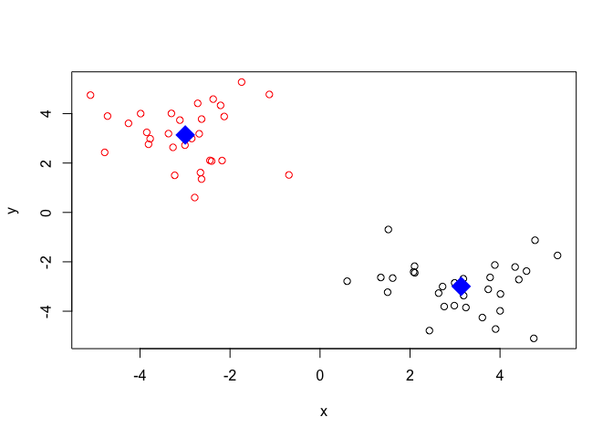
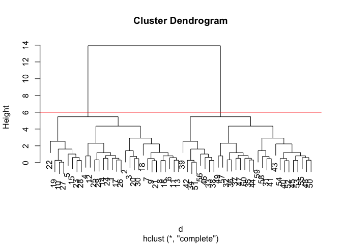
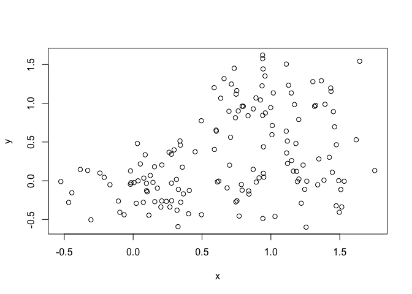
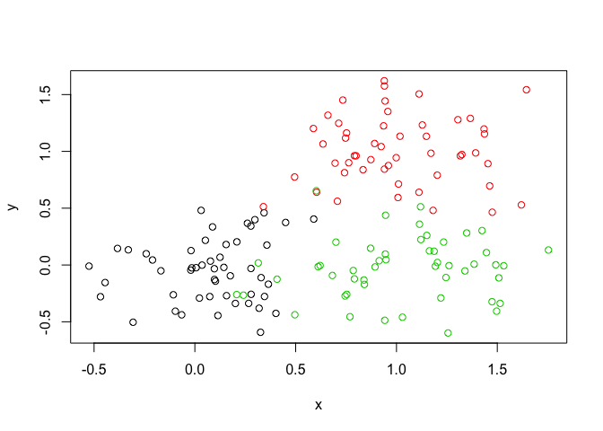
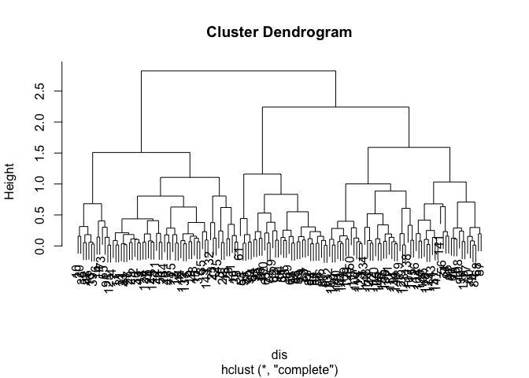
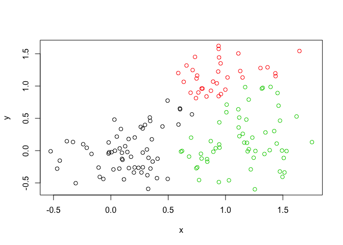
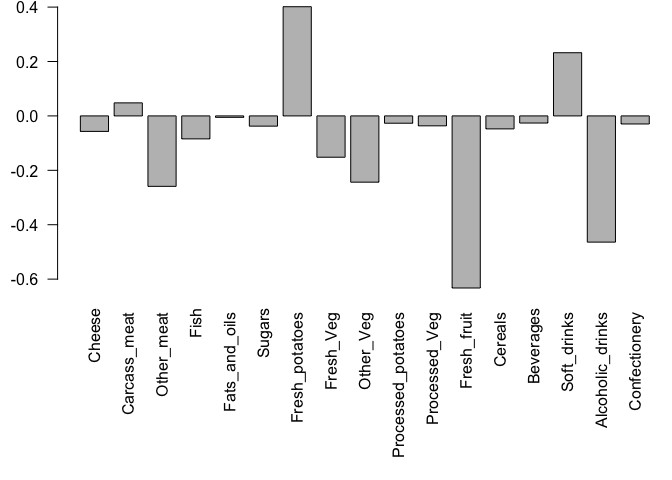

BGGN213\_Class8
================
Yutao Wen
4/26/2019

Clustering - Kmeans Function
----------------------------

``` r
# Generate some example data for clustering
tmp <- c(rnorm(30,-3), rnorm(30,3))
x <- cbind(x=tmp, y=rev(tmp))
plot(x)
```


``` r
kmeans(x, centers=2, nstart=20)
```

    ## K-means clustering with 2 clusters of sizes 30, 30
    ## 
    ## Cluster means:
    ##           x         y
    ## 1 -2.994675  3.136604
    ## 2  3.136604 -2.994675
    ## 
    ## Clustering vector:
    ##  [1] 1 1 1 1 1 1 1 1 1 1 1 1 1 1 1 1 1 1 1 1 1 1 1 1 1 1 1 1 1 1 2 2 2 2 2
    ## [36] 2 2 2 2 2 2 2 2 2 2 2 2 2 2 2 2 2 2 2 2 2 2 2 2 2
    ## 
    ## Within cluster sum of squares by cluster:
    ## [1] 69.94856 69.94856
    ##  (between_SS / total_SS =  89.0 %)
    ## 
    ## Available components:
    ## 
    ## [1] "cluster"      "centers"      "totss"        "withinss"    
    ## [5] "tot.withinss" "betweenss"    "size"         "iter"        
    ## [9] "ifault"

``` r
km <- kmeans(x, centers=2, nstart=20)
```

> Q. How many points are in each cluster?

> Q. What ‘component’ of your result object details - cluster size?

``` r
km["size"]
```

    ## $size
    ## [1] 30 30

      - cluster assignment/membership? 
      

``` r
km["cluster"]
```

    ## $cluster
    ##  [1] 2 2 2 2 2 2 2 2 2 2 2 2 2 2 2 2 2 2 2 2 2 2 2 2 2 2 2 2 2 2 1 1 1 1 1
    ## [36] 1 1 1 1 1 1 1 1 1 1 1 1 1 1 1 1 1 1 1 1 1 1 1 1 1

      - cluster center? 
      

``` r
km$centers
```

    ##           x         y
    ## 1  3.136604 -2.994675
    ## 2 -2.994675  3.136604

> Plot x colored by the kmeans cluster assignment and add cluster centers as blue points

``` r
# Plot scatterplot colored by different clusters
plot(x, col=km$cluster)

# Add center points to the plot
points(km$centers, col="blue", pch=18, cex=3)
```



Hierarchical Clustering - hclust Function
-----------------------------------------

Here we dont have to spell out K, the number of clusters but we need to give it a distance matrix as input

``` r
d <-  dist(x)
hc <- hclust(d)
plot(hc)
```


``` r
# Draw a line at height = 6 and cut the tree under
plot(hc)
abline(h=6, col="red")
```



``` r
cutree(hc, h=6)
```

    ##  [1] 1 1 1 1 1 1 1 1 1 1 1 1 1 1 1 1 1 1 1 1 1 1 1 1 1 1 1 1 1 1 2 2 2 2 2
    ## [36] 2 2 2 2 2 2 2 2 2 2 2 2 2 2 2 2 2 2 2 2 2 2 2 2 2

``` r
# or can use plot(hc, k=2)
```

``` r
gp2 <- cutree(hc, k=2)
gp2
```

    ##  [1] 1 1 1 1 1 1 1 1 1 1 1 1 1 1 1 1 1 1 1 1 1 1 1 1 1 1 1 1 1 1 2 2 2 2 2
    ## [36] 2 2 2 2 2 2 2 2 2 2 2 2 2 2 2 2 2 2 2 2 2 2 2 2 2

``` r
gp3 <- cutree(hc, k=3)
gp3
```

    ##  [1] 1 1 1 1 1 1 1 1 1 1 1 1 1 1 1 1 1 1 1 1 1 1 1 1 1 1 1 1 1 1 2 2 3 3 2
    ## [36] 2 2 3 3 2 2 3 2 2 2 3 2 2 2 2 3 2 2 2 2 3 2 2 2 2

``` r
table(gp2)
```

    ## gp2
    ##  1  2 
    ## 30 30

``` r
table(gp3)
```

    ## gp3
    ##  1  2  3 
    ## 30 22  8

``` r
table(gp2, gp3)
```

    ##    gp3
    ## gp2  1  2  3
    ##   1 30  0  0
    ##   2  0 22  8

Practice with another more complicated sample

``` r
# Step 1. Generate some example data for clustering
x <- rbind(
  matrix(rnorm(100, mean=0, sd = 0.3), ncol = 2),   # c1
  matrix(rnorm(100, mean = 1, sd = 0.3), ncol = 2), # c2
  matrix(c(rnorm(50, mean = 1, sd = 0.3),           # c3
           rnorm(50, mean = 0, sd = 0.3)), ncol = 2))
colnames(x) <- c("x", "y")
plot(x)
```



``` r
col <- as.factor( rep(c("c1","c2","c3"), each=50) )
plot(x, col=col)
```



``` r
dis <- dist(x)
hcl <- hclust(dis)
plot(hcl)
abline(h=4)
```



``` r
ct2 <- cutree(hcl, k=2)
ct3 <- cutree(hcl, k=3)
table(ct2, ct3)
```

    ##    ct3
    ## ct2  1  2  3
    ##   1 60  0  0
    ##   2  0 33 57

``` r
plot(x, col=ct3)
```



PCA - prcomp function
---------------------

``` r
mydata <- read.csv("https://bioboot.github.io/bggn213_S19/class-material/expression.csv", row.names = 1)
head(mydata)
```

    ##        wt1 wt2  wt3  wt4 wt5 ko1 ko2 ko3 ko4 ko5
    ## gene1  439 458  408  429 420  90  88  86  90  93
    ## gene2  219 200  204  210 187 427 423 434 433 426
    ## gene3 1006 989 1030 1017 973 252 237 238 226 210
    ## gene4  783 792  829  856 760 849 856 835 885 894
    ## gene5  181 249  204  244 225 277 305 272 270 279
    ## gene6  460 502  491  491 493 612 594 577 618 638

``` r
# transpose the data
head(t(mydata))
```

    ##     gene1 gene2 gene3 gene4 gene5 gene6 gene7 gene8 gene9 gene10 gene11
    ## wt1   439   219  1006   783   181   460    27   175   658    121    337
    ## wt2   458   200   989   792   249   502    30   182   669    116    337
    ## wt3   408   204  1030   829   204   491    37   184   653    134    330
    ## wt4   429   210  1017   856   244   491    29   166   633    117    322
    ## wt5   420   187   973   760   225   493    34   180   657    133    313
    ## ko1    90   427   252   849   277   612   304   255   628    931    100
    ##     gene12 gene13 gene14 gene15 gene16 gene17 gene18 gene19 gene20 gene21
    ## wt1    214    789    458    551    390    900    951    436    244    119
    ## wt2    194    738    490    555    400    970    991    414    266     87
    ## wt3    213    807    493    527    403    905    991    388    228     87
    ## wt4    192    768    446    552    402    850    983    418    223     88
    ## wt5    207    820    496    503    401    834    984    410    240     93
    ## ko1     97    293    694    712    755    353    217    162    540    914
    ##     gene22 gene23 gene24 gene25 gene26 gene27 gene28 gene29 gene30 gene31
    ## wt1    156     89    570    788   1007    937    224    809    624    218
    ## wt2    170     97    567    796    972    876    232    869    598    259
    ## wt3    150     96    563    766    977    901    231    815    587    213
    ## wt4    167     97    587    778   1003    958    238    788    552    204
    ## wt5    155     82    563    825   1027    957    226    781    592    213
    ## ko1    346    788    424    456    945    414    850    482    956     69
    ##     gene32 gene33 gene34 gene35 gene36 gene37 gene38 gene39 gene40 gene41
    ## wt1    906    262    155    100    117    286    321    388    606    379
    ## wt2    798    291    172    104    147    262    353    372    576    377
    ## wt3    828    258    173     94    120    260    334    345    558    362
    ## wt4    874    271    173    114    147    270    340    373    581    346
    ## wt5    890    279    192     90    145    293    316    359    574    354
    ## ko1    541    534    643    212    353    360    642     50    415    991
    ##     gene42 gene43 gene44 gene45 gene46 gene47 gene48 gene49 gene50 gene51
    ## wt1    471    592    755     35    758     24    100    809    955    453
    ## wt2    492    615    733     40    734     25    113    825    994    419
    ## wt3    473    602    775     28    704     12    136    833    994    443
    ## wt4    470    602    687     25    761     13    117    800    975    459
    ## wt5    471    655    776     32    672     22    103    776    973    469
    ## ko1    401    514    255    947    567    324    912    538    175    174
    ##     gene52 gene53 gene54 gene55 gene56 gene57 gene58 gene59 gene60 gene61
    ## wt1    327    657    678    304    659    673    785    501    232    928
    ## wt2    320    669    638    325    687    668    772    513    228    936
    ## wt3    324    631    676    312    659    694    817    462    193   1015
    ## wt4    321    701    683    327    667    699    766    484    247    971
    ## wt5    318    647    671    320    639    726    784    504    231    964
    ## ko1    489    246    259    819    109     18    467     37    997    428
    ##     gene62 gene63 gene64 gene65 gene66 gene67 gene68 gene69 gene70 gene71
    ## wt1    159    336    968    339     35     27     80    744    766    672
    ## wt2    169    344    888    335     32     28     69    685    739    736
    ## wt3    163    372    907    373     45     25     87    733    751    672
    ## wt4    151    389    914    338     37     35     87    693    720    715
    ## wt5    166    357    883    328     38     27     81    746    738    693
    ## ko1    869    664    886    275    765    200    693    745    645    839
    ##     gene72 gene73 gene74 gene75 gene76 gene77 gene78 gene79 gene80 gene81
    ## wt1    526    627    468    986    348    719    883    837    666    804
    ## wt2    553    650    466    945    333    714    899    883    657    735
    ## wt3    534    664    477   1006    344    734    868    864    719    771
    ## wt4    511    622    469   1020    321    693    873    807    656    763
    ## wt5    529    606    494   1024    296    682    882    854    638    813
    ## ko1    922    805    703    359    770    620    803    210    549    613
    ##     gene82 gene83 gene84 gene85 gene86 gene87 gene88 gene89 gene90 gene91
    ## wt1    476    438    938     29    810    575    451    174    158    371
    ## wt2    494    430    934     29    830    579    471    170    122    367
    ## wt3    521    477    976     30    760    567    494    205    138    369
    ## wt4    494    457    965     19    796    565    447    175    159    339
    ## wt5    482    481    960     21    807    576    470    179    128    360
    ## ko1    183    466    904    618    486    352    540    298    863    103
    ##     gene92 gene93 gene94 gene95 gene96 gene97 gene98 gene99 gene100
    ## wt1    853    208    555    527    589    396     33    321      25
    ## wt2    798    214    584    573    607    384     27    343      34
    ## wt3    866    200    574    548    579    382     39    349      34
    ## wt4    843    196    599    548    536    399     42    367      36
    ## wt5    823    206    581    552    583    401     33    343      32
    ## ko1    934    409    292    686    497    460    977    949     661

There are 100 genes in my dataset

``` r
pca <- prcomp(t(mydata), scale=TRUE)
summary(pca)
```

    ## Importance of components:
    ##                           PC1    PC2     PC3     PC4     PC5     PC6
    ## Standard deviation     9.6237 1.5198 1.05787 1.05203 0.88062 0.82545
    ## Proportion of Variance 0.9262 0.0231 0.01119 0.01107 0.00775 0.00681
    ## Cumulative Proportion  0.9262 0.9493 0.96045 0.97152 0.97928 0.98609
    ##                            PC7     PC8     PC9      PC10
    ## Standard deviation     0.80111 0.62065 0.60342 3.348e-15
    ## Proportion of Variance 0.00642 0.00385 0.00364 0.000e+00
    ## Cumulative Proportion  0.99251 0.99636 1.00000 1.000e+00

``` r
attributes(pca)
```

    ## $names
    ## [1] "sdev"     "rotation" "center"   "scale"    "x"       
    ## 
    ## $class
    ## [1] "prcomp"

Let's make our first PCA plot

``` r
plot(pca$x[,1], pca$x[,2])
```


``` r
# Variance captured per PC
 pca.var <- pca$sdev^2
 pca.var.per <- round(pca.var/sum(pca.var)*100, 1)
 pca.var.per
```

    ##  [1] 92.6  2.3  1.1  1.1  0.8  0.7  0.6  0.4  0.4  0.0

``` r
#xlab <- paste("PC1(", pca.var.per[1],")%")
#ylab <- paste("PC2(", pca.var.per[2],")%")
#plot(pca$x[,1], pca$x[,2], xlab = xlab, y = ylab, col=mycols)
```

UK Food Practice
----------------

``` r
x <- read.csv("https://bioboot.github.io/bggn213_S19/class-material/UK_foods.csv", row.names = 1)
head(x)
```

    ##                England Wales Scotland N.Ireland
    ## Cheese             105   103      103        66
    ## Carcass_meat       245   227      242       267
    ## Other_meat         685   803      750       586
    ## Fish               147   160      122        93
    ## Fats_and_oils      193   235      184       209
    ## Sugars             156   175      147       139

``` r
dim(x)
```

    ## [1] 17  4

``` r
barplot(as.matrix(x), beside=T, col=rainbow(nrow(x)))
```


``` r
barplot(as.matrix(x), beside=F, col=rainbow(nrow(x)))
```


``` r
pairs(x, col=rainbow(10), pch=16)
```


``` r
PCA <- prcomp(t(x))
summary(PCA)
```

    ## Importance of components:
    ##                             PC1      PC2      PC3       PC4
    ## Standard deviation     324.1502 212.7478 73.87622 4.189e-14
    ## Proportion of Variance   0.6744   0.2905  0.03503 0.000e+00
    ## Cumulative Proportion    0.6744   0.9650  1.00000 1.000e+00

``` r
# Plot PC1 vs PC2
plot(PCA$x[,1], PCA$x[,2], xlab="PC1", ylab="PC2", xlim=c(-270,500))
text(PCA$x[,1], PCA$x[,2], colnames(x), col = c("yellow", "red", "blue", "green"))
```


``` r
v <- round(PCA$sdev^2/sum(PCA$sdev^2)*100)
v
```

    ## [1] 67 29  4  0

``` r
z <- summary(PCA)
z$importance
```

    ##                              PC1       PC2      PC3          PC4
    ## Standard deviation     324.15019 212.74780 73.87622 4.188568e-14
    ## Proportion of Variance   0.67444   0.29052  0.03503 0.000000e+00
    ## Cumulative Proportion    0.67444   0.96497  1.00000 1.000000e+00

``` r
barplot(v, xlab="Principal Component", ylab="Percent Variation")
```


``` r
PCA$rotation
```

    ##                              PC1          PC2         PC3          PC4
    ## Cheese              -0.056955380 -0.016012850 -0.02394295 -0.691718038
    ## Carcass_meat         0.047927628 -0.013915823 -0.06367111  0.635384915
    ## Other_meat          -0.258916658  0.015331138  0.55384854  0.198175921
    ## Fish                -0.084414983  0.050754947 -0.03906481 -0.015824630
    ## Fats_and_oils       -0.005193623  0.095388656  0.12522257  0.052347444
    ## Sugars              -0.037620983  0.043021699  0.03605745  0.014481347
    ## Fresh_potatoes       0.401402060  0.715017078  0.20668248 -0.151706089
    ## Fresh_Veg           -0.151849942  0.144900268 -0.21382237  0.056182433
    ## Other_Veg           -0.243593729  0.225450923  0.05332841 -0.080722623
    ## Processed_potatoes  -0.026886233 -0.042850761  0.07364902 -0.022618707
    ## Processed_Veg       -0.036488269  0.045451802 -0.05289191  0.009235001
    ## Fresh_fruit         -0.632640898  0.177740743 -0.40012865 -0.021899087
    ## Cereals             -0.047702858  0.212599678  0.35884921  0.084667257
    ## Beverages           -0.026187756  0.030560542  0.04135860 -0.011880823
    ## Soft_drinks          0.232244140 -0.555124311  0.16942648 -0.144367046
    ## Alcoholic_drinks    -0.463968168 -0.113536523  0.49858320 -0.115797605
    ## Confectionery       -0.029650201 -0.005949921  0.05232164 -0.003695024

``` r
par(mar=c(10,3, 0.35, 0))
barplot(PCA$rotation[,1], las=2)
```



``` r
par(mar=c(10,3, 0.35, 0))
barplot(PCA$rotation[,2], las=2)
```


``` r
biplot(PCA)
```


