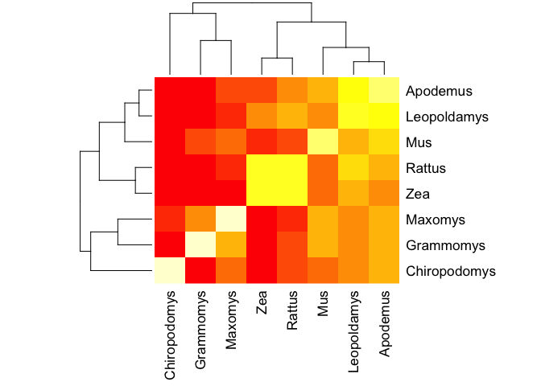

BGGN213\_FAG
================
Yutao Wen
6/4/2019

``` r
library(bio3d)
align <- read.fasta("muscle-I20190531-021744-0544-80951647-p2m.fst")
mat <- seqidentity(alignment = align)
heatmap(mat, margins=c(8,5))
```



``` r
cons <- consensus(align)
bla <- blast.pdb(cons$seq,database = "pdb")
```

    ##  Searching ... please wait (updates every 5 seconds) RID = FGE3KTE3014 
    ##  .
    ##  Reporting 103 hits

``` r
raw <- bla$hit.tbl
ids <- raw$subjectids
ids
```

    ##   [1] "1QLX_A" "4KML_A" "4YXL_A" "1B10_A" "4MA7_A" "1DX0_A" "1QM0_A"
    ##   [8] "2L1H_A" "2LSB_A" "2LFT_A" "5L6R_A" "2LEJ_A" "2M8T_A" "2KFO_A"
    ##  [15] "5YJ4_A" "5YJ5_A" "2K5O_A" "1FKC_A" "3HEQ_A" "1XYX_A" "2L40_A"
    ##  [22] "2L1E_A" "3HES_A" "2KU5_A" "2KUN_A" "4YX2_A" "1Y15_A" "2L1D_A"
    ##  [29] "2KFM_A" "2KU6_A" "4H88_A" "1Y16_A" "2L1K_A" "2JOH_A" "2JOM_A"
    ##  [36] "2FJ3_A" "3HAF_A" "2K56_A" "2K1D_A" "3HER_A" "2N53_A" "1XYJ_A"
    ##  [43] "1AG2_A" "1Y2S_A" "1DWY_A" "2W9E_A" "1I4M_A" "1XYU_A" "4HMM_A"
    ##  [50] "1QM2_A" "6AQ7_A" "4DGI_A" "1XYW_A" "4HMR_A" "1XYK_A" "4YXK_A"
    ##  [57] "4HLS_A" "4YXH_A" "2LH8_A" "1XYQ_A" "1H0L_A" "2KU4_A" "1TQC_A"
    ##  [64] "1TQB_A" "2MV9_A" "1TPX_A" "1UW3_A" "1E1G_A" "1E1U_A" "3O79_A"
    ##  [71] "3HAK_A" "1HJM_A" "1E1P_A" "3HJX_A" "2MV8_A" "2KFL_A" "2KKG_A"
    ##  [78] "2KTM_A" "1U5L_A" "1U3M_A" "1XU0_A" "1G04_A" "2RMV_A" "2RMW_A"
    ##  [85] "2IV5_A" "2IV6_A" "1S4T_A" "1SKH_A" "2IV4_A" "4J8R_I" "4J8R_I"
    ##  [92] "4J8R_I" "4J8R_I" "1I17_A" "1LG4_A" "2RSK_C" "1OBA_A" "1H09_A"
    ##  [99] "2IXV_A" "2IXU_A" "6NCR_A" "3VFF_A" "4QB8_A"

``` r
pdb.annotate(ids = ids)
```

    ## Warning in pdb.annotate(ids = ids): ids should be standard 4 character PDB-
    ## IDs: trying first 4 characters...

    ##        structureId chainId experimentalTechnique resolution       ligandId
    ## 1QLX_A        1QLX       A          SOLUTION NMR       <NA>           <NA>
    ## 4KML_A        4KML       A     X-RAY DIFFRACTION        1.5           <NA>
    ## 4YXL_A        4YXL       A     X-RAY DIFFRACTION        2.6           <NA>
    ## 1B10_A        1B10       A          SOLUTION NMR       <NA>           <NA>
    ## 4MA7_A        4MA7       A     X-RAY DIFFRACTION       1.97            P2Z
    ## 1DX0_A        1DX0       A          SOLUTION NMR       <NA>           <NA>
    ## 1QM0_A        1QM0       A          SOLUTION NMR       <NA>           <NA>
    ## 2L1H_A        2L1H       A          SOLUTION NMR       <NA>           <NA>
    ## 2LSB_A        2LSB       A          SOLUTION NMR       <NA>           <NA>
    ## 2LFT_A        2LFT       A          SOLUTION NMR       <NA>           <NA>
    ## 5L6R_A        5L6R       A          SOLUTION NMR       <NA>           <NA>
    ## 2LEJ_A        2LEJ       A          SOLUTION NMR       <NA>           <NA>
    ## 2M8T_A        2M8T       A          SOLUTION NMR       <NA>           <NA>
    ## 2KFO_A        2KFO       A          SOLUTION NMR       <NA>           <NA>
    ## 5YJ4_A        5YJ4       A          SOLUTION NMR       <NA>           <NA>
    ## 5YJ5_A        5YJ5       A          SOLUTION NMR       <NA>           <NA>
    ## 2K5O_A        2K5O       A          SOLUTION NMR       <NA>           <NA>
    ## 1FKC_A        1FKC       A          SOLUTION NMR       <NA>           <NA>
    ## 3HEQ_A        3HEQ       A     X-RAY DIFFRACTION        1.8             CD
    ## 1XYX_A        1XYX       A          SOLUTION NMR       <NA>           <NA>
    ## 2L40_A        2L40       A          SOLUTION NMR       <NA>           <NA>
    ## 2L1E_A        2L1E       A          SOLUTION NMR       <NA>           <NA>
    ## 3HES_A        3HES       A     X-RAY DIFFRACTION        2.0           <NA>
    ## 2KU5_A        2KU5       A          SOLUTION NMR       <NA>           <NA>
    ## 2KUN_A        2KUN       A          SOLUTION NMR       <NA>           <NA>
    ## 4YX2_A        4YX2       A     X-RAY DIFFRACTION       2.19           <NA>
    ## 1Y15_A        1Y15       A          SOLUTION NMR       <NA>           <NA>
    ## 2L1D_A        2L1D       A          SOLUTION NMR       <NA>           <NA>
    ## 2KFM_A        2KFM       A          SOLUTION NMR       <NA>           <NA>
    ## 2KU6_A        2KU6       A          SOLUTION NMR       <NA>           <NA>
    ## 4H88_A        4H88       A     X-RAY DIFFRACTION        1.9           <NA>
    ## 1Y16_A        1Y16       A          SOLUTION NMR       <NA>           <NA>
    ## 2L1K_A        2L1K       A          SOLUTION NMR       <NA>           <NA>
    ## 2JOH_A        2JOH       A          SOLUTION NMR       <NA>           <NA>
    ## 2JOM_A        2JOM       A          SOLUTION NMR       <NA>           <NA>
    ## 2FJ3_A        2FJ3       A          SOLUTION NMR       <NA>           <NA>
    ## 3HAF_A        3HAF       A     X-RAY DIFFRACTION       2.26          CD,CL
    ## 2K56_A        2K56       A          SOLUTION NMR       <NA>           <NA>
    ## 2K1D_A        2K1D       A          SOLUTION NMR       <NA>           <NA>
    ## 3HER_A        3HER       A     X-RAY DIFFRACTION       1.85             CD
    ## 2N53_A        2N53       A          SOLUTION NMR       <NA>           <NA>
    ## 1XYJ_A        1XYJ       A          SOLUTION NMR       <NA>           <NA>
    ## 1AG2_A        1AG2       A          SOLUTION NMR       <NA>           <NA>
    ## 1Y2S_A        1Y2S       A          SOLUTION NMR       <NA>           <NA>
    ## 1DWY_A        1DWY       A          SOLUTION NMR       <NA>           <NA>
    ## 2W9E_A        2W9E       A     X-RAY DIFFRACTION        2.9            SO4
    ## 1I4M_A        1I4M       A     X-RAY DIFFRACTION        2.0          CD,CL
    ## 1XYU_A        1XYU       A          SOLUTION NMR       <NA>           <NA>
    ## 4HMM_A        4HMM       A     X-RAY DIFFRACTION        1.5      CL,GOL,NA
    ## 1QM2_A        1QM2       A          SOLUTION NMR       <NA>           <NA>
    ## 6AQ7_A        6AQ7       A     X-RAY DIFFRACTION       1.83            GOL
    ## 4DGI_A        4DGI       A     X-RAY DIFFRACTION        2.4           <NA>
    ## 1XYW_A        1XYW       A          SOLUTION NMR       <NA>           <NA>
    ## 4HMR_A        4HMR       A     X-RAY DIFFRACTION        1.6          CL,NA
    ## 1XYK_A        1XYK       A          SOLUTION NMR       <NA>           <NA>
    ## 4YXK_A        4YXK       A     X-RAY DIFFRACTION       2.81           <NA>
    ## 4HLS_A        4HLS       A     X-RAY DIFFRACTION       1.45          CL,NA
    ## 4YXH_A        4YXH       A     X-RAY DIFFRACTION        2.7           <NA>
    ## 2LH8_A        2LH8       A          SOLUTION NMR       <NA>            VIB
    ## 1XYQ_A        1XYQ       A          SOLUTION NMR       <NA>           <NA>
    ## 1H0L_A        1H0L       A          SOLUTION NMR       <NA>           <NA>
    ## 2KU4_A        2KU4       A          SOLUTION NMR       <NA>           <NA>
    ## 1TQC_A        1TQC       A     X-RAY DIFFRACTION        2.8           <NA>
    ## 1TQB_A        1TQB       A     X-RAY DIFFRACTION       2.55           <NA>
    ## 2MV9_A        2MV9       A          SOLUTION NMR       <NA>           <NA>
    ## 1TPX_A        1TPX       A     X-RAY DIFFRACTION       2.56           <NA>
    ## 1UW3_A        1UW3       A     X-RAY DIFFRACTION       2.05        GSH,PO4
    ## 1E1G_A        1E1G       A          SOLUTION NMR       <NA>           <NA>
    ## 1E1U_A        1E1U       A          SOLUTION NMR       <NA>           <NA>
    ## 3O79_A        3O79       A     X-RAY DIFFRACTION        1.6          CL,NA
    ## 3HAK_A        3HAK       A     X-RAY DIFFRACTION        1.8           <NA>
    ## 1HJM_A        1HJM       A          SOLUTION NMR       <NA>           <NA>
    ## 1E1P_A        1E1P       A          SOLUTION NMR       <NA>           <NA>
    ## 3HJX_A        3HJX       A     X-RAY DIFFRACTION        2.0          CD,CL
    ## 2MV8_A        2MV8       A          SOLUTION NMR       <NA>           <NA>
    ## 2KFL_A        2KFL       A          SOLUTION NMR       <NA>           <NA>
    ## 2KKG_A        2KKG       A          SOLUTION NMR       <NA>           <NA>
    ## 2KTM_A        2KTM       A          SOLUTION NMR       <NA>           <NA>
    ## 1U5L_A        1U5L       A          SOLUTION NMR       <NA>           <NA>
    ## 1U3M_A        1U3M       A          SOLUTION NMR       <NA>           <NA>
    ## 1XU0_A        1XU0       A          SOLUTION NMR       <NA>           <NA>
    ## 1G04_A        1G04       A          SOLUTION NMR       <NA>           <NA>
    ## 2RMV_A        2RMV       A          SOLUTION NMR       <NA>           <NA>
    ## 2RMW_A        2RMW       A          SOLUTION NMR       <NA>           <NA>
    ## 2IV5_A        2IV5       A          SOLUTION NMR       <NA>           <NA>
    ## 2IV6_A        2IV6       A          SOLUTION NMR       <NA>           <NA>
    ## 1S4T_A        1S4T       A          SOLUTION NMR       <NA>           <NA>
    ## 1SKH_A        1SKH       A          SOLUTION NMR       <NA>           <NA>
    ## 2IV4_A        2IV4       A          SOLUTION NMR       <NA>           <NA>
    ## 4J8R_I        4J8R       I     X-RAY DIFFRACTION        2.3           <NA>
    ## 1I17_A        1I17       A          SOLUTION NMR       <NA>           <NA>
    ## 1LG4_A        1LG4       A          SOLUTION NMR       <NA>           <NA>
    ## 2RSK_C        2RSK       C          SOLUTION NMR       <NA>           <NA>
    ## 1OBA_A        1OBA       A     X-RAY DIFFRACTION       2.45            CHT
    ## 1H09_A        1H09       A     X-RAY DIFFRACTION        2.1           <NA>
    ## 2IXV_A        2IXV       A     X-RAY DIFFRACTION       1.96    FMT,MU2,NAG
    ## 2IXU_A        2IXU       A     X-RAY DIFFRACTION       2.28    FMT,MU2,NAG
    ## 6NCR_A        6NCR       A     X-RAY DIFFRACTION       1.75 ACT,CA,EDO,TRP
    ## 3VFF_A        3VFF       A     X-RAY DIFFRACTION       2.78            CD8
    ## 4QB8_A        4QB8       A     X-RAY DIFFRACTION       1.76        1TE,PO4
    ##                                                                                                             ligandName
    ## 1QLX_A                                                                                                            <NA>
    ## 4KML_A                                                                                                            <NA>
    ## 4YXL_A                                                                                                            <NA>
    ## 1B10_A                                                                                                            <NA>
    ## 4MA7_A                                                                                                       Promazine
    ## 1DX0_A                                                                                                            <NA>
    ## 1QM0_A                                                                                                            <NA>
    ## 2L1H_A                                                                                                            <NA>
    ## 2LSB_A                                                                                                            <NA>
    ## 2LFT_A                                                                                                            <NA>
    ## 5L6R_A                                                                                                            <NA>
    ## 2LEJ_A                                                                                                            <NA>
    ## 2M8T_A                                                                                                            <NA>
    ## 2KFO_A                                                                                                            <NA>
    ## 5YJ4_A                                                                                                            <NA>
    ## 5YJ5_A                                                                                                            <NA>
    ## 2K5O_A                                                                                                            <NA>
    ## 1FKC_A                                                                                                            <NA>
    ## 3HEQ_A                                                                                                     CADMIUM ION
    ## 1XYX_A                                                                                                            <NA>
    ## 2L40_A                                                                                                            <NA>
    ## 2L1E_A                                                                                                            <NA>
    ## 3HES_A                                                                                                            <NA>
    ## 2KU5_A                                                                                                            <NA>
    ## 2KUN_A                                                                                                            <NA>
    ## 4YX2_A                                                                                                            <NA>
    ## 1Y15_A                                                                                                            <NA>
    ## 2L1D_A                                                                                                            <NA>
    ## 2KFM_A                                                                                                            <NA>
    ## 2KU6_A                                                                                                            <NA>
    ## 4H88_A                                                                                                            <NA>
    ## 1Y16_A                                                                                                            <NA>
    ## 2L1K_A                                                                                                            <NA>
    ## 2JOH_A                                                                                                            <NA>
    ## 2JOM_A                                                                                                            <NA>
    ## 2FJ3_A                                                                                                            <NA>
    ## 3HAF_A                                                                                        CADMIUM ION,CHLORIDE ION
    ## 2K56_A                                                                                                            <NA>
    ## 2K1D_A                                                                                                            <NA>
    ## 3HER_A                                                                                                     CADMIUM ION
    ## 2N53_A                                                                                                            <NA>
    ## 1XYJ_A                                                                                                            <NA>
    ## 1AG2_A                                                                                                            <NA>
    ## 1Y2S_A                                                                                                            <NA>
    ## 1DWY_A                                                                                                            <NA>
    ## 2W9E_A                                                                                                     SULFATE ION
    ## 1I4M_A                                                                                        CADMIUM ION,CHLORIDE ION
    ## 1XYU_A                                                                                                            <NA>
    ## 4HMM_A                                                                                CHLORIDE ION,GLYCEROL,SODIUM ION
    ## 1QM2_A                                                                                                            <NA>
    ## 6AQ7_A                                                                                                        GLYCEROL
    ## 4DGI_A                                                                                                            <NA>
    ## 1XYW_A                                                                                                            <NA>
    ## 4HMR_A                                                                                         CHLORIDE ION,SODIUM ION
    ## 1XYK_A                                                                                                            <NA>
    ## 4YXK_A                                                                                                            <NA>
    ## 4HLS_A                                                                                         CHLORIDE ION,SODIUM ION
    ## 4YXH_A                                                                                                            <NA>
    ## 2LH8_A                            3-(4-AMINO-2-METHYL-PYRIMIDIN-5-YLMETHYL)-5-(2-HYDROXY-ETHYL)-4-METHYL-THIAZOL-3-IUM
    ## 1XYQ_A                                                                                                            <NA>
    ## 1H0L_A                                                                                                            <NA>
    ## 2KU4_A                                                                                                            <NA>
    ## 1TQC_A                                                                                                            <NA>
    ## 1TQB_A                                                                                                            <NA>
    ## 2MV9_A                                                                                                            <NA>
    ## 1TPX_A                                                                                                            <NA>
    ## 1UW3_A                                                                                       GLUTATHIONE,PHOSPHATE ION
    ## 1E1G_A                                                                                                            <NA>
    ## 1E1U_A                                                                                                            <NA>
    ## 3O79_A                                                                                         CHLORIDE ION,SODIUM ION
    ## 3HAK_A                                                                                                            <NA>
    ## 1HJM_A                                                                                                            <NA>
    ## 1E1P_A                                                                                                            <NA>
    ## 3HJX_A                                                                                        CADMIUM ION,CHLORIDE ION
    ## 2MV8_A                                                                                                            <NA>
    ## 2KFL_A                                                                                                            <NA>
    ## 2KKG_A                                                                                                            <NA>
    ## 2KTM_A                                                                                                            <NA>
    ## 1U5L_A                                                                                                            <NA>
    ## 1U3M_A                                                                                                            <NA>
    ## 1XU0_A                                                                                                            <NA>
    ## 1G04_A                                                                                                            <NA>
    ## 2RMV_A                                                                                                            <NA>
    ## 2RMW_A                                                                                                            <NA>
    ## 2IV5_A                                                                                                            <NA>
    ## 2IV6_A                                                                                                            <NA>
    ## 1S4T_A                                                                                                            <NA>
    ## 1SKH_A                                                                                                            <NA>
    ## 2IV4_A                                                                                                            <NA>
    ## 4J8R_I                                                                                                            <NA>
    ## 1I17_A                                                                                                            <NA>
    ## 1LG4_A                                                                                                            <NA>
    ## 2RSK_C                                                                                                            <NA>
    ## 1OBA_A                                                                                                     CHOLINE ION
    ## 1H09_A                                                                                                            <NA>
    ## 2IXV_A                                      FORMIC ACID,N-ACETYLMURAMYL-L-ALANYL-D-ISOGLUTAMINE,N-ACETYL-D-GLUCOSAMINE
    ## 2IXU_A                                      FORMIC ACID,N-ACETYLMURAMYL-L-ALANYL-D-ISOGLUTAMINE,N-ACETYL-D-GLUCOSAMINE
    ## 6NCR_A                                                               ACETATE ION,CALCIUM ION,1,2-ETHANEDIOL,TRYPTOPHAN
    ## 3VFF_A (2R)-2-[(1S)-1-(benzoylamino)-1-methoxy-2-oxoethyl]-5-methylidene-5,6-dihydro-2H-1,3-thiazine-4-carboxylic acid
    ## 4QB8_A                                                                                         TEBIPENEM,PHOSPHATE ION
    ##                            source
    ## 1QLX_A               Homo sapiens
    ## 4KML_A               Homo sapiens
    ## 4YXL_A       Mesocricetus auratus
    ## 1B10_A       Mesocricetus auratus
    ## 4MA7_A               Mus musculus
    ## 1DX0_A                 Bos taurus
    ## 1QM0_A               Homo sapiens
    ## 2L1H_A               Mus musculus
    ## 2LSB_A               Homo sapiens
    ## 2LFT_A               Homo sapiens
    ## 5L6R_A               Homo sapiens
    ## 2LEJ_A               Homo sapiens
    ## 2M8T_A               Homo sapiens
    ## 2KFO_A               Mus musculus
    ## 5YJ4_A               Homo sapiens
    ## 5YJ5_A               Homo sapiens
    ## 2K5O_A               Mus musculus
    ## 1FKC_A               Homo sapiens
    ## 3HEQ_A               Homo sapiens
    ## 1XYX_A               Mus musculus
    ## 2L40_A               Mus musculus
    ## 2L1E_A               Mus musculus
    ## 3HES_A               Homo sapiens
    ## 2KU5_A               Mus musculus
    ## 2KUN_A               Homo sapiens
    ## 4YX2_A                 Bos taurus
    ## 1Y15_A               Mus musculus
    ## 2L1D_A               Mus musculus
    ## 2KFM_A               Mus musculus
    ## 2KU6_A               Mus musculus
    ## 4H88_A               Mus musculus
    ## 1Y16_A               Mus musculus
    ## 2L1K_A               Mus musculus
    ## 2JOH_A      Oryctolagus cuniculus
    ## 2JOM_A      Oryctolagus cuniculus
    ## 2FJ3_A      Oryctolagus cuniculus
    ## 3HAF_A               Homo sapiens
    ## 2K56_A           Myodes glareolus
    ## 2K1D_A               Homo sapiens
    ## 3HER_A               Homo sapiens
    ## 2N53_A                 Ovis aries
    ## 1XYJ_A                Felis catus
    ## 1AG2_A               Mus musculus
    ## 1Y2S_A                 Ovis aries
    ## 1DWY_A                 Bos taurus
    ## 2W9E_A               Homo sapiens
    ## 1I4M_A               Homo sapiens
    ## 1XYU_A                 Ovis aries
    ## 4HMM_A      Oryctolagus cuniculus
    ## 1QM2_A               Homo sapiens
    ## 6AQ7_A               Mus musculus
    ## 4DGI_A               Homo sapiens
    ## 1XYW_A          Cervus canadensis
    ## 4HMR_A      Oryctolagus cuniculus
    ## 1XYK_A                Canis lupus
    ## 4YXK_A          Cervus canadensis
    ## 4HLS_A      Oryctolagus cuniculus
    ## 4YXH_A        Odocoileus hemionus
    ## 2LH8_A       Mesocricetus auratus
    ## 1XYQ_A                 Sus scrofa
    ## 1H0L_A               Homo sapiens
    ## 2KU4_A             Equus caballus
    ## 1TQC_A                 Ovis aries
    ## 1TQB_A                 Ovis aries
    ## 2MV9_A                 Ovis aries
    ## 1TPX_A                 Ovis aries
    ## 1UW3_A                 Ovis aries
    ## 1E1G_A               Homo sapiens
    ## 1E1U_A               Homo sapiens
    ## 3O79_A      Oryctolagus cuniculus
    ## 3HAK_A               Homo sapiens
    ## 1HJM_A               Homo sapiens
    ## 1E1P_A               Homo sapiens
    ## 3HJX_A               Homo sapiens
    ## 2MV8_A                 Ovis aries
    ## 2KFL_A       Notamacropus eugenii
    ## 2KKG_A       Mesocricetus auratus
    ## 2KTM_A                 Ovis aries
    ## 1U5L_A          Trachemys scripta
    ## 1U3M_A              Gallus gallus
    ## 1XU0_A             Xenopus laevis
    ## 1G04_A                 Ovis aries
    ## 2RMV_A                 Ovis aries
    ## 2RMW_A                 Ovis aries
    ## 2IV5_A               Homo sapiens
    ## 2IV6_A               Homo sapiens
    ## 1S4T_A                 Ovis aries
    ## 1SKH_A                 Bos taurus
    ## 2IV4_A               Homo sapiens
    ## 4J8R_I               Mus musculus
    ## 1I17_A               Mus musculus
    ## 1LG4_A               Homo sapiens
    ## 2RSK_C                 Bos taurus
    ## 1OBA_A    Streptococcus virus Cp1
    ## 1H09_A    Streptococcus virus Cp1
    ## 2IXV_A    Streptococcus virus Cp1
    ## 2IXU_A    Streptococcus virus Cp1
    ## 6NCR_A      Chlamydia trachomatis
    ## 3VFF_A Mycobacterium tuberculosis
    ## 4QB8_A Mycobacterium tuberculosis
    ##                                                           scopDomain
    ## 1QLX_A                                          Prion protein domain
    ## 4KML_A                                                          <NA>
    ## 4YXL_A                                                          <NA>
    ## 1B10_A                                          Prion protein domain
    ## 4MA7_A                                                          <NA>
    ## 1DX0_A                                          Prion protein domain
    ## 1QM0_A                                          Prion protein domain
    ## 2L1H_A                                                          <NA>
    ## 2LSB_A                                                          <NA>
    ## 2LFT_A                                                          <NA>
    ## 5L6R_A                                                          <NA>
    ## 2LEJ_A                                                          <NA>
    ## 2M8T_A                                                          <NA>
    ## 2KFO_A                                                          <NA>
    ## 5YJ4_A                                                          <NA>
    ## 5YJ5_A                                                          <NA>
    ## 2K5O_A                                                          <NA>
    ## 1FKC_A                                          Prion protein domain
    ## 3HEQ_A                                                          <NA>
    ## 1XYX_A                                          Prion protein domain
    ## 2L40_A                                                          <NA>
    ## 2L1E_A                                                          <NA>
    ## 3HES_A                                                          <NA>
    ## 2KU5_A                                                          <NA>
    ## 2KUN_A                                                          <NA>
    ## 4YX2_A                                                          <NA>
    ## 1Y15_A                                          Prion protein domain
    ## 2L1D_A                                                          <NA>
    ## 2KFM_A                                                          <NA>
    ## 2KU6_A                                                          <NA>
    ## 4H88_A                                                          <NA>
    ## 1Y16_A                                                          <NA>
    ## 2L1K_A                                                          <NA>
    ## 2JOH_A                                                          <NA>
    ## 2JOM_A                                                          <NA>
    ## 2FJ3_A                                                          <NA>
    ## 3HAF_A                                                          <NA>
    ## 2K56_A                                                          <NA>
    ## 2K1D_A                                                          <NA>
    ## 3HER_A                                                          <NA>
    ## 2N53_A                                                          <NA>
    ## 1XYJ_A                                          Prion protein domain
    ## 1AG2_A                                          Prion protein domain
    ## 1Y2S_A                                          Prion protein domain
    ## 1DWY_A                                          Prion protein domain
    ## 2W9E_A                                                          <NA>
    ## 1I4M_A                                          Prion protein domain
    ## 1XYU_A                                          Prion protein domain
    ## 4HMM_A                                                          <NA>
    ## 1QM2_A                                          Prion protein domain
    ## 6AQ7_A                                                          <NA>
    ## 4DGI_A                                                          <NA>
    ## 1XYW_A                                          Prion protein domain
    ## 4HMR_A                                                          <NA>
    ## 1XYK_A                                          Prion protein domain
    ## 4YXK_A                                                          <NA>
    ## 4HLS_A                                                          <NA>
    ## 4YXH_A                                                          <NA>
    ## 2LH8_A                                                          <NA>
    ## 1XYQ_A                                          Prion protein domain
    ## 1H0L_A                                          Prion protein domain
    ## 2KU4_A                                                          <NA>
    ## 1TQC_A                                          Prion protein domain
    ## 1TQB_A                                          Prion protein domain
    ## 2MV9_A                                                          <NA>
    ## 1TPX_A                                          Prion protein domain
    ## 1UW3_A                                          Prion protein domain
    ## 1E1G_A                                          Prion protein domain
    ## 1E1U_A                                          Prion protein domain
    ## 3O79_A                                                          <NA>
    ## 3HAK_A                                                          <NA>
    ## 1HJM_A                                          Prion protein domain
    ## 1E1P_A                                          Prion protein domain
    ## 3HJX_A                                                          <NA>
    ## 2MV8_A                                                          <NA>
    ## 2KFL_A                                                          <NA>
    ## 2KKG_A                                                          <NA>
    ## 2KTM_A                                                          <NA>
    ## 1U5L_A                                          Prion protein domain
    ## 1U3M_A                                          Prion protein domain
    ## 1XU0_A                                          Prion protein domain
    ## 1G04_A                                       Prion protein fragments
    ## 2RMV_A                                       Prion protein fragments
    ## 2RMW_A                                       Prion protein fragments
    ## 2IV5_A                                                          <NA>
    ## 2IV6_A                                                          <NA>
    ## 1S4T_A                                       Prion protein fragments
    ## 1SKH_A                                                          <NA>
    ## 2IV4_A                                                          <NA>
    ## 4J8R_I                                                          <NA>
    ## 1I17_A                                     Prion-like protein Doppel
    ## 1LG4_A                                     Prion-like protein Doppel
    ## 2RSK_C                                                          <NA>
    ## 1OBA_A C-terminal domain of endolysin#N-terminal domain of endolysin
    ## 1H09_A C-terminal domain of endolysin#N-terminal domain of endolysin
    ## 2IXV_A C-terminal domain of endolysin#N-terminal domain of endolysin
    ## 2IXU_A C-terminal domain of endolysin#N-terminal domain of endolysin
    ## 6NCR_A                                                          <NA>
    ## 3VFF_A                                                          <NA>
    ## 4QB8_A                                                          <NA>
    ##                          classification
    ## 1QLX_A                    PRION PROTEIN
    ## 4KML_A MEMBRANE PROTEIN/PROTEIN BINDING
    ## 4YXL_A                    IMMUNE SYSTEM
    ## 1B10_A                    PRION PROTEIN
    ## 4MA7_A                    IMMUNE SYSTEM
    ## 1DX0_A                    PRION PROTEIN
    ## 1QM0_A                    PRION PROTEIN
    ## 2L1H_A                 MEMBRANE PROTEIN
    ## 2LSB_A                 MEMBRANE PROTEIN
    ## 2LFT_A                 MEMBRANE PROTEIN
    ## 5L6R_A                TRANSPORT PROTEIN
    ## 2LEJ_A                 MEMBRANE PROTEIN
    ## 2M8T_A                       CELL CYCLE
    ## 2KFO_A                 UNKNOWN FUNCTION
    ## 5YJ4_A                 MEMBRANE PROTEIN
    ## 5YJ5_A                 MEMBRANE PROTEIN
    ## 2K5O_A                 UNKNOWN FUNCTION
    ## 1FKC_A                 MEMBRANE PROTEIN
    ## 3HEQ_A                 MEMBRANE PROTEIN
    ## 1XYX_A                 UNKNOWN FUNCTION
    ## 2L40_A                 MEMBRANE PROTEIN
    ## 2L1E_A                 MEMBRANE PROTEIN
    ## 3HES_A                 MEMBRANE PROTEIN
    ## 2KU5_A                 UNKNOWN FUNCTION
    ## 2KUN_A                 MEMBRANE PROTEIN
    ## 4YX2_A                    IMMUNE SYSTEM
    ## 1Y15_A                 UNKNOWN FUNCTION
    ## 2L1D_A                 MEMBRANE PROTEIN
    ## 2KFM_A                 UNKNOWN FUNCTION
    ## 2KU6_A                 UNKNOWN FUNCTION
    ## 4H88_A                    IMMUNE SYSTEM
    ## 1Y16_A                 UNKNOWN FUNCTION
    ## 2L1K_A                 MEMBRANE PROTEIN
    ## 2JOH_A                 UNKNOWN FUNCTION
    ## 2JOM_A                 UNKNOWN FUNCTION
    ## 2FJ3_A                 MEMBRANE PROTEIN
    ## 3HAF_A                 MEMBRANE PROTEIN
    ## 2K56_A                 UNKNOWN FUNCTION
    ## 2K1D_A                 UNKNOWN FUNCTION
    ## 3HER_A                 MEMBRANE PROTEIN
    ## 2N53_A                       CELL CYCLE
    ## 1XYJ_A                 UNKNOWN FUNCTION
    ## 1AG2_A                    PRION PROTEIN
    ## 1Y2S_A                 UNKNOWN FUNCTION
    ## 1DWY_A                    PRION PROTEIN
    ## 2W9E_A                    IMMUNE SYSTEM
    ## 1I4M_A                 MEMBRANE PROTEIN
    ## 1XYU_A                 UNKNOWN FUNCTION
    ## 4HMM_A                 MEMBRANE PROTEIN
    ## 1QM2_A                    PRION PROTEIN
    ## 6AQ7_A                    IMMUNE SYSTEM
    ## 4DGI_A                  PROTEIN BINDING
    ## 1XYW_A                 UNKNOWN FUNCTION
    ## 4HMR_A                 MEMBRANE PROTEIN
    ## 1XYK_A                 UNKNOWN FUNCTION
    ## 4YXK_A                    IMMUNE SYSTEM
    ## 4HLS_A                 MEMBRANE PROTEIN
    ## 4YXH_A                    IMMUNE SYSTEM
    ## 2LH8_A                 MEMBRANE PROTEIN
    ## 1XYQ_A                 UNKNOWN FUNCTION
    ## 1H0L_A                       CELL CYCLE
    ## 2KU4_A                 MEMBRANE PROTEIN
    ## 1TQC_A   UNKNOWN FUNCTION/IMMUNE SYSTEM
    ## 1TQB_A   UNKNOWN FUNCTION/IMMUNE SYSTEM
    ## 2MV9_A                    IMMUNE SYSTEM
    ## 1TPX_A                 UNKNOWN FUNCTION
    ## 1UW3_A                 MEMBRANE PROTEIN
    ## 1E1G_A                    PRION PROTEIN
    ## 1E1U_A                    PRION PROTEIN
    ## 3O79_A                 MEMBRANE PROTEIN
    ## 3HAK_A                 MEMBRANE PROTEIN
    ## 1HJM_A                    PRION PROTEIN
    ## 1E1P_A                    PRION PROTEIN
    ## 3HJX_A                 MEMBRANE PROTEIN
    ## 2MV8_A                    IMMUNE SYSTEM
    ## 2KFL_A                 UNKNOWN FUNCTION
    ## 2KKG_A                 MEMBRANE PROTEIN
    ## 2KTM_A                 MEMBRANE PROTEIN
    ## 1U5L_A                 MEMBRANE PROTEIN
    ## 1U3M_A                 MEMBRANE PROTEIN
    ## 1XU0_A                 MEMBRANE PROTEIN
    ## 1G04_A                 UNKNOWN FUNCTION
    ## 2RMV_A                   PROTEIN FIBRIL
    ## 2RMW_A                   PROTEIN FIBRIL
    ## 2IV5_A                    PRION PROTEIN
    ## 2IV6_A                    PRION PROTEIN
    ## 1S4T_A                 UNKNOWN FUNCTION
    ## 1SKH_A                 UNKNOWN FUNCTION
    ## 2IV4_A                    PRION PROTEIN
    ## 4J8R_I                    IMMUNE SYSTEM
    ## 1I17_A                 UNKNOWN FUNCTION
    ## 1LG4_A                    Prion Protein
    ## 2RSK_C             Membrane Protein/RNA
    ## 1OBA_A                        HYDROLASE
    ## 1H09_A                        HYDROLASE
    ## 2IXV_A                        HYDROLASE
    ## 2IXU_A                        HYDROLASE
    ## 6NCR_A                           LIGASE
    ## 3VFF_A    Hydrolase/hydrolase inhibitor
    ## 4QB8_A             hydrolase/antibiotic
    ##                                              compound
    ## 1QLX_A                                  PRION PROTEIN
    ## 4KML_A                            Major prion protein
    ## 4YXL_A                            Major prion protein
    ## 1B10_A                        PROTEIN (PRION PROTEIN)
    ## 4MA7_A                            Major prion protein
    ## 1DX0_A                                  PRION PROTEIN
    ## 1QM0_A                                  PRION PROTEIN
    ## 2L1H_A                            Major prion protein
    ## 2LSB_A                            Major prion protein
    ## 2LFT_A                            Major prion protein
    ## 5L6R_A                            Major prion protein
    ## 2LEJ_A                            Major prion protein
    ## 2M8T_A                            Major prion protein
    ## 2KFO_A                            Major prion protein
    ## 5YJ4_A                            Major prion protein
    ## 5YJ5_A                            Major prion protein
    ## 2K5O_A                            Major prion protein
    ## 1FKC_A                                  PRION PROTEIN
    ## 3HEQ_A                            Major prion protein
    ## 1XYX_A                            Major prion protein
    ## 2L40_A                            Major prion protein
    ## 2L1E_A                            Major prion protein
    ## 3HES_A                            Major prion protein
    ## 2KU5_A                            Major prion protein
    ## 2KUN_A                            Major prion protein
    ## 4YX2_A                            Major prion protein
    ## 1Y15_A                            Major prion protein
    ## 2L1D_A                            Major prion protein
    ## 2KFM_A                            Major prion protein
    ## 2KU6_A                            Major prion protein
    ## 4H88_A                            Major prion protein
    ## 1Y16_A                            Major prion protein
    ## 2L1K_A                            Major prion protein
    ## 2JOH_A                            Major prion protein
    ## 2JOM_A                            Major prion protein
    ## 2FJ3_A                            Major prion protein
    ## 3HAF_A                            Major prion protein
    ## 2K56_A                            Major prion protein
    ## 2K1D_A                            Major prion protein
    ## 3HER_A                            Major prion protein
    ## 2N53_A                            Major prion protein
    ## 1XYJ_A                                  prion protein
    ## 1AG2_A                            MAJOR PRION PROTEIN
    ## 1Y2S_A                            Major prion protein
    ## 1DWY_A                                  PRION PROTEIN
    ## 2W9E_A                            MAJOR PRION PROTEIN
    ## 1I4M_A                            MAJOR PRION PROTEIN
    ## 1XYU_A                            Major prion protein
    ## 4HMM_A                            Major prion protein
    ## 1QM2_A                                  PRION PROTEIN
    ## 6AQ7_A                            Major prion protein
    ## 4DGI_A                            Major prion protein
    ## 1XYW_A                            Major prion protein
    ## 4HMR_A                            Major prion protein
    ## 1XYK_A                                  prion protein
    ## 4YXK_A                            Major prion protein
    ## 4HLS_A                            Major prion protein
    ## 4YXH_A                            Major prion protein
    ## 2LH8_A                            Major prion protein
    ## 1XYQ_A                            Major prion protein
    ## 1H0L_A                            MAJOR PRION PROTEIN
    ## 2KU4_A                            Major prion protein
    ## 1TQC_A                                  prion protein
    ## 1TQB_A                                  prion protein
    ## 2MV9_A                            Major prion protein
    ## 1TPX_A                            major prion protein
    ## 1UW3_A                                  PRION PROTEIN
    ## 1E1G_A                                  PRION PROTEIN
    ## 1E1U_A                                  PRION PROTEIN
    ## 3O79_A                                     Rabbit PrP
    ## 3HAK_A                            Major prion protein
    ## 1HJM_A                  MAJOR PRION PROTEIN PRECURSOR
    ## 1E1P_A                                  PRION PROTEIN
    ## 3HJX_A                            Major prion protein
    ## 2MV8_A                            Major prion protein
    ## 2KFL_A                            Major prion protein
    ## 2KKG_A                            Major prion protein
    ## 2KTM_A                            Major prion protein
    ## 1U5L_A                                  prion protein
    ## 1U3M_A                             prion-like protein
    ## 1XU0_A                                  prion protein
    ## 1G04_A                            MAJOR PRION PROTEIN
    ## 2RMV_A                            Major prion protein
    ## 2RMW_A                            Major prion protein
    ## 2IV5_A                            MAJOR PRION PROTEIN
    ## 2IV6_A                            MAJOR PRION PROTEIN
    ## 1S4T_A                            Major prion protein
    ## 1SKH_A                          Major prion protein 2
    ## 2IV4_A                            MAJOR PRION PROTEIN
    ## 4J8R_I                            Major prion protein
    ## 1I17_A                             PRION-LIKE PROTEIN
    ## 1LG4_A                             Prion-like protein
    ## 2RSK_C partial binding peptide of Major prion protein
    ## 1OBA_A                                       LYSOZYME
    ## 1H09_A                                       LYSOZYME
    ## 2IXV_A                                       LYSOZYME
    ## 2IXU_A                                       LYSOZYME
    ## 6NCR_A                        Tryptophan--tRNA ligase
    ## 3VFF_A                                 Beta-lactamase
    ## 4QB8_A                                 Beta-lactamase
    ##                                                                                                                                                      title
    ## 1QLX_A                                                                                                   NMR Solution Structure of the Human Prion Protein
    ## 4KML_A                               Probing the N-Terminal beta-Sheet Conversion in the Crystal Structure of the Human Prion Protein Bound to a Nanobody.
    ## 4YXL_A                       X-ray structural and molecular dynamical studies of the globular domains of cow, deer, elk and Syrian hamster prion proteins.
    ## 1B10_A                      Solution structure of a 142-residue recombinant prion protein corresponding to the infectious fragment of the scrapie isoform.
    ## 4MA7_A                                                                                    Structural basis of prion inhibition by phenothiazine compounds.
    ## 1DX0_A                                                                                                           NMR Structure of the Bovine Prion Protein
    ## 1QM0_A                                                                                                   NMR Solution Structure of the Human Prion Protein
    ## 2L1H_A                                                                Temperature-dependent conformational exchange in the cellular form of prion proteins
    ## 2LSB_A                            Structural basis for the protective effect of the human prion protein carrying the dominant-negative E219K polymorphism.
    ## 2LFT_A                            Structural basis for the protective effect of the human prion protein carrying the dominant-negative E219K polymorphism.
    ## 5L6R_A                                                                 Truncated prion protein PrP226* - A structural view on its role in amyloid disease.
    ## 2LEJ_A                               Toward the Molecular Basis of Inherited Prion Diseases: NMR Structure of the Human Prion Protein with V210I Mutation.
    ## 2M8T_A                                                 Thermodynamic Stabilization of the Folded Domain of Prion Protein Inhibits Prion Infection in Vivo.
    ## 2KFO_A    Prion Protein NMR Structure from Tammar Wallaby (Macropus eugenii) Shows that the beta2-alpha2 Loop Is Modulated by Long-Range Sequence Effects.
    ## 5YJ4_A                                              Structural basis for the complete resistance of the human prion protein mutant G127V to prion disease.
    ## 5YJ5_A                                              Structural basis for the complete resistance of the human prion protein mutant G127V to prion disease.
    ## 2K5O_A                                         NMR Structure of the Bank Vole Prion Protein at 20 degrees C Contains a Structured Loop of Residues 165-171
    ## 1FKC_A          Solution structure of the E200K variant of human prion protein. Implications for the mechanism of pathogenesis in familial prion diseases.
    ## 3HEQ_A                                                  Conformational diversity in prion protein variants influences intermolecular beta-sheet formation.
    ## 1XYX_A                                                                                        Prion protein NMR structures of elk and of mouse/elk hybrids
    ## 2L40_A                                                                                                   Cellular prion protein conformation and function.
    ## 2L1E_A                                                                            Prion Protein mPrP[F175A](121-231): Structure and Stability in Solution.
    ## 3HES_A                                                  Conformational diversity in prion protein variants influences intermolecular beta-sheet formation.
    ## 2KU5_A                                                 Horse prion protein NMR structure and comparisons with related variants of the mouse prion protein.
    ## 2KUN_A                                   NMR structure of the human prion protein with the pathological Q212P mutation reveals unique structural features.
    ## 4YX2_A                       X-ray structural and molecular dynamical studies of the globular domains of cow, deer, elk and Syrian hamster prion proteins.
    ## 1Y15_A                                                                                        Prion protein NMR structures of elk and of mouse/elk hybrids
    ## 2L1D_A                                                                                                   Cellular prion protein conformation and function.
    ## 2KFM_A    Prion Protein NMR Structure from Tammar Wallaby (Macropus eugenii) Shows that the beta2-alpha2 Loop Is Modulated by Long-Range Sequence Effects.
    ## 2KU6_A                                                 Horse prion protein NMR structure and comparisons with related variants of the mouse prion protein.
    ## 4H88_A                                                         The toxicity of antiprion antibodies is mediated by the flexible tail of the prion protein.
    ## 1Y16_A                                                                                        Prion protein NMR structures of elk and of mouse/elk hybrids
    ## 2L1K_A                                                                Temperature-dependent conformational exchange in the cellular form of prion proteins
    ## 2JOH_A                                                                                      Unique structural characteristics of the rabbit prion protein.
    ## 2JOM_A                                                                    Solution Structure and Dynamics of the I214V Mutant of the Rabbit Prion Protein.
    ## 2FJ3_A                                                                                       Unique structural characteristics of the rabbit prion protein
    ## 3HAF_A                                                  Conformational diversity in prion protein variants influences intermolecular beta-sheet formation.
    ## 2K56_A                                        NMR Structure of the Bank Vole Prion Protein at 20 degrees C Contains a Structured Loop of Residues 165-171.
    ## 2K1D_A               Residue 129 polymorphism and conformational dynamics of familial prion diseases associated with the human prion protein variant D178N
    ## 3HER_A                                                  Conformational diversity in prion protein variants influences intermolecular beta-sheet formation.
    ## 2N53_A                                                                                      Generating Bona Fide Mammalian Prions with Internal Deletions.
    ## 1XYJ_A                                                                                         Prion protein NMR structures of cats, dogs, pigs, and sheep
    ## 1AG2_A                                                                                       NMR structure of the mouse prion protein domain PrP(121-231).
    ## 1Y2S_A                                                                                         Prion protein NMR structures of cats, dogs, pigs, and sheep
    ## 1DWY_A                                                                                                           NMR Structure of the Bovine Prion Protein
    ## 2W9E_A                                                                           Crystal Structure of Human Prion Protein Bound to a Therapeutic Antibody.
    ## 1I4M_A                                                               Crystal structure of the human prion protein reveals a mechanism for oligomerization.
    ## 1XYU_A                                                                                         Prion protein NMR structures of cats, dogs, pigs, and sheep
    ## 4HMM_A                                         N-Terminal Helix-Cap in alpha-Helix 2 Modulates beta-State Misfolding in Rabbit and Hamster Prion Proteins.
    ## 1QM2_A                                                                                                   NMR Solution Structure of the Human Prion Protein
    ## 6AQ7_A                Structural characterization of POM6 Fab and mouse prion protein complex identifies key regions for prions conformational conversion.
    ## 4DGI_A                                  Structural studies on the folded domain of the human prion protein bound to the Fab fragment of the antibody POM1.
    ## 1XYW_A                                                                                        Prion protein NMR structures of elk and of mouse/elk hybrids
    ## 4HMR_A                                         N-Terminal Helix-Cap in alpha-Helix 2 Modulates beta-State Misfolding in Rabbit and Hamster Prion Proteins.
    ## 1XYK_A                                                                                         Prion protein NMR structures of cats, dogs, pigs, and sheep
    ## 4YXK_A                       X-ray structural and molecular dynamical studies of the globular domains of cow, deer, elk and Syrian hamster prion proteins.
    ## 4HLS_A                                         N-Terminal Helix-Cap in alpha-Helix 2 Modulates beta-State Misfolding in Rabbit and Hamster Prion Proteins.
    ## 4YXH_A                       X-ray structural and molecular dynamical studies of the globular domains of cow, deer, elk and Syrian hamster prion proteins.
    ## 2LH8_A                                                                                                                   The prion protein binds thiamine.
    ## 1XYQ_A                                                                                         Prion protein NMR structures of cats, dogs, pigs, and sheep
    ## 1H0L_A                                                                           NMR Structure of a Variant Human Prion Protein with Two Disulfide Bridges
    ## 2KU4_A                                                 Horse prion protein NMR structure and comparisons with related variants of the mouse prion protein.
    ## 1TQC_A                          Insight into the PrPC-->PrPSc conversion from the structures of antibody-bound ovine prion scrapie-susceptibility variants
    ## 1TQB_A                          Insight into the PrPC-->PrPSc conversion from the structures of antibody-bound ovine prion scrapie-susceptibility variants
    ## 2MV9_A                                                                                      Generating Bona Fide Mammalian Prions with Internal Deletions.
    ## 1TPX_A                        Insight into the PrPC -> PrPSc conversion from the structures of antibody-bound ovine prion scrapie-susceptibility variants.
    ## 1UW3_A                                                                                 The Crystal Structure of the Globular Domain of Sheep Prion Protein
    ## 1E1G_A                                                                          NMR Structures of Three Single-Residue Variants of the Human Prion Protein
    ## 1E1U_A                                                                          NMR Structures of Three Single-Residue Variants of the Human Prion Protein
    ## 3O79_A                             Prion disease susceptibility is affected by beta-structure folding propensity and local side-chain interactions in PrP.
    ## 3HAK_A                                                  Conformational diversity in prion protein variants influences intermolecular beta-sheet formation.
    ## 1HJM_A                                                           Influence of Ph on NMR Structure and Stability of the Human Prion Protein Globular Domain
    ## 1E1P_A                                                                          NMR Structures of Three Single-Residue Variants of the Human Prion Protein
    ## 3HJX_A                                                  Conformational diversity in prion protein variants influences intermolecular beta-sheet formation.
    ## 2MV8_A                                                                                      Generating Bona Fide Mammalian Prions with Internal Deletions.
    ## 2KFL_A    Prion Protein NMR Structure from Tammar Wallaby (Macropus eugenii) Shows that the beta2-alpha2 Loop Is Modulated by Long-Range Sequence Effects.
    ## 2KKG_A                                                        Structure of the flexible amino-terminal domain of prion protein bound to a sulfated glycan.
    ## 2KTM_A                                                   Prion fibrillization is mediated by a native structural element that comprises helices H2 and H3.
    ## 1U5L_A                                                                                           Prion protein NMR structures of chicken, turtle, and frog
    ## 1U3M_A                                                                                        Prion protein NMR structures of chickens, turtles, and frogs
    ## 1XU0_A                                                                                           Prion protein NMR structures of chicken, turtle, and frog
    ## 1G04_A               Sheep prion protein synthetic peptide spanning helix 1 and beta-strand 2 (residues 142-166) shows beta-hairpin structure in solution.
    ## 2RMV_A                           Key role of the residue 155 in the mechanism of prion transconformation highlighted by the study of sheep mutant peptides
    ## 2RMW_A                           Key role of the residue 155 in the mechanism of prion transconformation highlighted by the study of sheep mutant peptides
    ## 2IV5_A                  The Conformational Landscape of the Human Prion Protein Alpha 2 Domain: Comparative NMR and Md Studies on Helix-2-Derived Peptides
    ## 2IV6_A                  The Conformational Landscape of the Human Prion Protein Alpha 2 Domain: Comparative NMR and Md Studies on Helix-2-Derived Peptides
    ## 1S4T_A Specific recognition between surface loop 2 (132-143) and helix 1 (144-154)  within sheep prion protein from in vitro studies of synthetic peptides
    ## 1SKH_A                                      NMR solution structure and membrane interaction of the N-terminal sequence (1-30) of the bovine prion protein.
    ## 2IV4_A                  The Conformational Landscape of the Human Prion Protein Alpha 2 Domain: Comparative NMR and Md Studies on Helix-2-Derived Peptides
    ## 4J8R_I                            The crystal structure of an octapeptide repeat of the Prion protein in complex with a Fab fragment of the POM2 antibody.
    ## 1I17_A                                                                Two different neurodegenerative diseases caused by proteins with similar structures.
    ## 1LG4_A                                                                                                           NMR Structure of the Human Doppel Protein
    ## 2RSK_C                                                                                      Anti-prion activity of an RNA aptamer and its structural basis
    ## 1OBA_A                                          Structural Basis for Selective Recognition of Pneumococcal Cell Wall by Modular Endolysin from Phage Cp-1.
    ## 1H09_A                                           Structural Basis for Selective Recognition of Pneumococcal Cell Wall by Modular Endolysin from Phage Cp-1
    ## 2IXV_A                                      Elucidation of the Molecular Recognition of Bacterial Cell Wall by Modular Pneumococcal Phage Endolysin Cpl-1.
    ## 2IXU_A                                      Elucidation of the Molecular Recognition of Bacterial Cell Wall by Modular Pneumococcal Phage Endolysin Cpl-1.
    ## 6NCR_A                                                      Crystal Structure of Tryptophan-tRNA ligase from Chlamydia trachomatis with bound L-tryptophan
    ## 3VFF_A                                                                                   BlaC-Specific Fluorogenic Probes for Rapid Tuberculosis Detection
    ## 4QB8_A                       Tebipenem, a new carbapenem antibiotic, is a slow substrate that inhibits the beta-lactamase from Mycobacterium tuberculosis.
    ##                                                                                                                                                                                                                                  citationAuthor
    ## 1QLX_A                                                                                                            Zahn, R., Liu, A., Luhrs, T., Riek, R., Von Schroetter, C., Garcia, F.L., Billeter, M., Calzolai, L., Wider, G., Wuthrich, K.
    ## 4KML_A                                                                                                                                          Abskharon, R.N., Giachin, G., Wohlkonig, A., Soror, S.H., Pardon, E., Legname, G., Steyaert, J.
    ## 4YXL_A                                                                                                                                                                                   Baral, P.K., Swayampakula, M., Aguzzi, A., James, M.N.
    ## 1B10_A                                                                                            James, T.L., Liu, H., Ulyanov, N.B., Farr-Jones, S., Zhang, H., Donne, D.G., Kaneko, K., Groth, D., Mehlhorn, I., Prusiner, S.B., Cohen, F.E.
    ## 4MA7_A                                                                                                                                         Baral, P.K., Swayampakula, M., Rout, M.K., Kav, N.N., Spyracopoulos, L., Aguzzi, A., James, M.N.
    ## 1DX0_A                                                                                                                                                                                       Lopez-Garcia, F., Zahn, R., Riek, R., Wuthrich, K.
    ## 1QM0_A                                                                                                            Zahn, R., Liu, A., Luhrs, T., Riek, R., Von Schroetter, C., Garcia, F.L., Billeter, M., Calzolai, L., Wider, G., Wuthrich, K.
    ## 2L1H_A                                                                                                                                                                  Christen, B., Damberger, F.F., Perez, D.R., Hornemann, S., Wuthrich, K.
    ## 2LSB_A                                                                                                                                                                    Biljan, I., Giachin, G., Ilc, G., Zhukov, I., Plavec, J., Legname, G.
    ## 2LFT_A                                                                                                                                                                    Biljan, I., Giachin, G., Ilc, G., Zhukov, I., Plavec, J., Legname, G.
    ## 5L6R_A                                                                                                                                                                           Kovac, V., Zupancic, B., Ilc, G., Plavec, J., Curin Serbec, V.
    ## 2LEJ_A                                                                                                                                                     Biljan, I., Ilc, G., Giachin, G., Raspadori, A., Zhukov, I., Plavec, J., Legname, G.
    ## 2M8T_A                                                                         Kong, Q., Mills, J.L., Kundu, B., Li, X., Qing, L., Surewicz, K., Cali, I., Huang, S., Zheng, M., Swietnicki, W., Sonnichsen, F.D., Gambetti, P., Surewicz, W.K.
    ## 2KFO_A                                                                                                                                                                               Christen, B., Hornemann, S., Damberger, F.F., Wuthrich, K.
    ## 5YJ4_A                                                                                                                                                      Zheng, Z., Zhang, M., Wang, Y., Ma, R., Guo, C., Feng, L., Wu, J., Yao, H., Lin, D.
    ## 5YJ5_A                                                                                                                                                      Zheng, Z., Zhang, M., Wang, Y., Ma, R., Guo, C., Feng, L., Wu, J., Yao, H., Lin, D.
    ## 2K5O_A                                                                                                                                                                                   Christen, B., Perez, D.R., Hornemann, S., Wuthrich, K.
    ## 1FKC_A                                                                                                                                                              Zhang, Y., Swietnicki, W., Zagorski, M.G., Surewicz, W.K., Sonnichsen, F.D.
    ## 3HEQ_A                                                                                                                                                  Lee, S., Antony, L., Hartmann, R., Knaus, K.J., Surewicz, K., Surewicz, W.K., Yee, V.C.
    ## 1XYX_A                                                                                                                                                                       Gossert, A.D., Bonjour, S., Lysek, D.A., Fiorito, F., Wuthrich, K.
    ## 2L40_A                                                                                                                                                                  Damberger, F.F., Christen, B., Perez, D.R., Hornemann, S., Wuthrich, K.
    ## 2L1E_A                                                                                                                                                                               Christen, B., Hornemann, S., Damberger, F.F., Wuthrich, K.
    ## 3HES_A                                                                                                                                                  Lee, S., Antony, L., Hartmann, R., Knaus, K.J., Surewicz, K., Surewicz, W.K., Yee, V.C.
    ## 2KU5_A                                                                                                                                                                                               Perez, D.R., Damberger, F.F., Wuthrich, K.
    ## 2KUN_A                                                                                                                                         Ilc, G., Giachin, G., Jaremko, M., Jaremko, L., Benetti, F., Plavec, J., Zhukov, I., Legname, G.
    ## 4YX2_A                                                                                                                                                                                   Baral, P.K., Swayampakula, M., Aguzzi, A., James, M.N.
    ## 1Y15_A                                                                                                                                                                       Gossert, A.D., Bonjour, S., Lysek, D.A., Fiorito, F., Wuthrich, K.
    ## 2L1D_A                                                                                                                                                                  Damberger, F.F., Christen, B., Perez, D.R., Hornemann, S., Wuthrich, K.
    ## 2KFM_A                                                                                                                                                                               Christen, B., Hornemann, S., Damberger, F.F., Wuthrich, K.
    ## 2KU6_A                                                                                                                                                                                               Perez, D.R., Damberger, F.F., Wuthrich, K.
    ## 4H88_A Sonati, T., Reimann, R.R., Falsig, J., Baral, P.K., O'Connor, T., Hornemann, S., Yaganoglu, S., Li, B., Herrmann, U.S., Wieland, B., Swayampakula, M., Rahman, M.H., Das, D., Kav, N., Riek, R., Liberski, P.P., James, M.N., Aguzzi, A.
    ## 1Y16_A                                                                                                                                                                       Gossert, A.D., Bonjour, S., Lysek, D.A., Fiorito, F., Wuthrich, K.
    ## 2L1K_A                                                                                                                                                                  Christen, B., Damberger, F.F., Perez, D.R., Hornemann, S., Wuthrich, K.
    ## 2JOH_A                                                                                                                                                               Wen, Y., Li, J., Yao, W., Xiong, M., Hong, J., Peng, Y., Xiao, G., Lin, D.
    ## 2JOM_A                                                                                                                                                                         Wen, Y., Li, J., Xiong, M., Peng, Y., Yao, W., Hong, J., Lin, D.
    ## 2FJ3_A                                                                                                                                                             Wen, Y., Li, J., Yao, W., Xiong, M., Hong, J., Peng, Y., Xiao, G., Lin, D.H.
    ## 3HAF_A                                                                                                                                                  Lee, S., Antony, L., Hartmann, R., Knaus, K.J., Surewicz, K., Surewicz, W.K., Yee, V.C.
    ## 2K56_A                                                                                                                                                                                   Christen, B., Perez, D.R., Hornemann, S., Wuthrich, K.
    ## 2K1D_A                                                                                                                                                                              Mills, J.L., Surewicz, K., Surewicz, W.K., Sonnichsen, F.D.
    ## 3HER_A                                                                                                                                                  Lee, S., Antony, L., Hartmann, R., Knaus, K.J., Surewicz, K., Surewicz, W.K., Yee, V.C.
    ## 2N53_A                                                                               Munoz-Montesino, C., Sizun, C., Moudjou, M., Herzog, L., Reine, F., Chapuis, J., Ciric, D., Igel-Egalon, A., Laude, H., Beringue, V., Rezaei, H., Dron, M.
    ## 1XYJ_A                                                                              Lysek, D.A., Schorn, C., Nivon, L.G., Esteve-Moya, V., Christen, B., Calzolai, L., von Schroetter, C., Fiorito, F., Herrmann, T., Guntert, P., Wuthrich, K.
    ## 1AG2_A                                                                                                                                                          Riek, R., Hornemann, S., Wider, G., Billeter, M., Glockshuber, R., Wuthrich, K.
    ## 1Y2S_A                                                                              Lysek, D.A., Schorn, C., Nivon, L.G., Esteve-Moya, V., Christen, B., Calzolai, L., von Schroetter, C., Fiorito, F., Herrmann, T., Guntert, P., Wuthrich, K.
    ## 1DWY_A                                                                                                                                                                                       Lopez-Garcia, F., Zahn, R., Riek, R., Wuthrich, K.
    ## 2W9E_A                                  Antonyuk, S.V., Trevitt, C.R., Strange, R.W., Jackson, G.S., Sangar, D., Batchelor, M., Cooper, S., Fraser, C., Jones, S., Georgiou, T., Khalili-Shirazi, A., Clarke, A.R., Hasnain, S.S., Collinge, J.
    ## 1I4M_A                                                                                                                                                         Knaus, K.J., Morillas, M., Swietnicki, W., Malone, M., Surewicz, W.K., Yee, V.C.
    ## 1XYU_A                                                                              Lysek, D.A., Schorn, C., Nivon, L.G., Esteve-Moya, V., Christen, B., Calzolai, L., von Schroetter, C., Fiorito, F., Herrmann, T., Guntert, P., Wuthrich, K.
    ## 4HMM_A                                                                                                                                                                         Sweeting, B., Brown, E., Khan, M.Q., Chakrabartty, A., Pai, E.F.
    ## 1QM2_A                                                                                                            Zahn, R., Liu, A., Luhrs, T., Riek, R., Von Schroetter, C., Garcia, F.L., Billeter, M., Calzolai, L., Wider, G., Wuthrich, K.
    ## 6AQ7_A                                                                                                                                                                                 Baral, P.K., Swayampakula, M., Aguzzi, A., James, M.N.G.
    ## 4DGI_A                                                                                                                            Baral, P.K., Wieland, B., Swayampakula, M., Polymenidou, M., Rahman, M.H., Kav, N.N., Aguzzi, A., James, M.N.
    ## 1XYW_A                                                                                                                                                                       Gossert, A.D., Bonjour, S., Lysek, D.A., Fiorito, F., Wuthrich, K.
    ## 4HMR_A                                                                                                                                                                         Sweeting, B., Brown, E., Khan, M.Q., Chakrabartty, A., Pai, E.F.
    ## 1XYK_A                                                                              Lysek, D.A., Schorn, C., Nivon, L.G., Esteve-Moya, V., Christen, B., Calzolai, L., von Schroetter, C., Fiorito, F., Herrmann, T., Guntert, P., Wuthrich, K.
    ## 4YXK_A                                                                                                                                                                                   Baral, P.K., Swayampakula, M., Aguzzi, A., James, M.N.
    ## 4HLS_A                                                                                                                                                                         Sweeting, B., Brown, E., Khan, M.Q., Chakrabartty, A., Pai, E.F.
    ## 4YXH_A                                                                                                                                                                                   Baral, P.K., Swayampakula, M., Aguzzi, A., James, M.N.
    ## 2LH8_A                                                                    Perez-Pineiro, R., Bjorndahl, T.C., Berjanskii, M.V., Hau, D., Li, L., Huang, A., Lee, R., Gibbs, E., Ladner, C., Dong, Y.W., Abera, A., Cashman, N.R., Wishart, D.S.
    ## 1XYQ_A                                                                              Lysek, D.A., Schorn, C., Nivon, L.G., Esteve-Moya, V., Christen, B., Calzolai, L., von Schroetter, C., Fiorito, F., Herrmann, T., Guntert, P., Wuthrich, K.
    ## 1H0L_A                                                                                                                                                                                  Zahn, R., Guntert, P., Von Schroetter, C., Wuthrich, K.
    ## 2KU4_A                                                                                                                                                                                               Perez, D.R., Damberger, F.F., Wuthrich, K.
    ## 1TQC_A                                                                                                                                   Eghiaian, F., Grosclaude, J., Lesceu, S., Debey, P., Doublet, B., Treguer, E., Rezaei, H., Knossow, M.
    ## 1TQB_A                                                                                                                                   Eghiaian, F., Grosclaude, J., Lesceu, S., Debey, P., Doublet, B., Treguer, E., Rezaei, H., Knossow, M.
    ## 2MV9_A                                                                               Munoz-Montesino, C., Sizun, C., Moudjou, M., Herzog, L., Reine, F., Chapuis, J., Ciric, D., Igel-Egalon, A., Laude, H., Beringue, V., Rezaei, H., Dron, M.
    ## 1TPX_A                                                                                                                                   Eghiaian, F., Grosclaude, J., Lesceu, S., Debey, P., Doublet, B., Treguer, E., Rezaei, H., Knossow, M.
    ## 1UW3_A                                                                                                                                   Haire, L.F., Whyte, S.M., Vasisht, N., Gill, A.C., Verma, C., Dodson, E.J., Dodson, G.G., Bayley, P.M.
    ## 1E1G_A                                                                                                                                             Calzolai, L., Lysek, D.A., Guntert, P., Von Schroetter, C., Zahn, R., Riek, R., Wuthrich, K.
    ## 1E1U_A                                                                                                                                             Calzolai, L., Lysek, D.A., Guntert, P., Von Schroetter, C., Zahn, R., Riek, R., Wuthrich, K.
    ## 3O79_A                                                                                                                                       Khan, M.Q., Sweeting, B., Mulligan, V.K., Arslan, P.E., Cashman, N.R., Pai, E.F., Chakrabartty, A.
    ## 3HAK_A                                                                                                                                                  Lee, S., Antony, L., Hartmann, R., Knaus, K.J., Surewicz, K., Surewicz, W.K., Yee, V.C.
    ## 1HJM_A                                                                                                                                                                                                                   Calzolai, L., Zahn, R.
    ## 1E1P_A                                                                                                                                             Calzolai, L., Lysek, D.A., Guntert, P., Von Schroetter, C., Zahn, R., Riek, R., Wuthrich, K.
    ## 3HJX_A                                                                                                                                                  Lee, S., Antony, L., Hartmann, R., Knaus, K.J., Surewicz, K., Surewicz, W.K., Yee, V.C.
    ## 2MV8_A                                                                               Munoz-Montesino, C., Sizun, C., Moudjou, M., Herzog, L., Reine, F., Chapuis, J., Ciric, D., Igel-Egalon, A., Laude, H., Beringue, V., Rezaei, H., Dron, M.
    ## 2KFL_A                                                                                                                                                                               Christen, B., Hornemann, S., Damberger, F.F., Wuthrich, K.
    ## 2KKG_A                                                                                                                                                                                 Taubner, L.M., Bienkiewicz, E.A., Copie, V., Caughey, B.
    ## 2KTM_A                                                                                                                                       Adrover, M., Pauwels, K., Prigent, S., de Chiara, C., Xu, Z., Chapuis, C., Pastore, A., Rezaei, H.
    ## 1U5L_A                                                                                                                                                                        Calzolai, L., Lysek, D.A., Perez, D.R., Guntert, P., Wuthrich, K.
    ## 1U3M_A                                                                                                                                                                        Calzolai, L., Lysek, D.A., Perez, D.R., Guntert, P., Wuthrich, K.
    ## 1XU0_A                                                                                                                                                                        Calzolai, L., Lysek, D.A., Perez, D.R., Guntert, P., Wuthrich, K.
    ## 1G04_A                                                                                                                      Kozin, S.A., Bertho, G., Mazur, A.K., Rabesona, H., Girault, J.P., Haertle, T., Takahashi, M., Debey, P., Hoa, G.H.
    ## 2RMV_A                                                                                                                                                                                 Bertho, G., Bouvier, G., Hui Bon Hoa, G., Girault, J.-P.
    ## 2RMW_A                                                                                                                                                                                 Bertho, G., Bouvier, G., Hui Bon Hoa, G., Girault, J.-P.
    ## 2IV5_A                                                                                          Ronga, L., Palladino, P., Tizzano, B., Costantini, S., Facchiano, A., Saviano, G., Tancredi, T., Ruvo, M., Ragone, R., Benedetti, E., Rossi, F.
    ## 2IV6_A                                                                                          Ronga, L., Palladino, P., Tizzano, B., Costantini, S., Facchiano, A., Saviano, G., Tancredi, T., Ruvo, M., Ragone, R., Benedetti, E., Rossi, F.
    ## 1S4T_A                                                                                                      Kozin, S.A., Lepage, C., Hui Bon Hoa, G., Rabesona, H., Mazur, A.K., Blond, A., Cheminant, M., Haertle, T., Debey, P., Rebuffat, S.
    ## 1SKH_A                                                                                                                                                                                   Biverstahl, H., Andersson, A., Graslund, A., Maler, L.
    ## 2IV4_A                                                                                          Ronga, L., Palladino, P., Tizzano, B., Costantini, S., Facchiano, A., Saviano, G., Tancredi, T., Ruvo, M., Ragone, R., Benedetti, E., Rossi, F.
    ## 4J8R_I                                                                                                                                                                        Swayampakula, M., Baral, P.K., Aguzzi, A., Kav, N.N., James, M.N.
    ## 1I17_A                                                                                                                                                Mo, H., Moore, R.C., Cohen, F.E., Westaway, D., Prusiner, S.B., Wright, P.E., Dyson, H.J.
    ## 1LG4_A                                                                                                                                                                                           Luhrs, T., Riek, R., Guntert, P., Wuthrich, K.
    ## 2RSK_C                                                                                                   Mashima, T., Nishikawa, F., Kamatari, Y.O., Fujiwara, H., Saimura, M., Nagata, T., Kodaki, T., Nishikawa, S., Kuwata, K., Katahira, M.
    ## 1OBA_A                                                                                                           Hermoso, J.A., Monterroso, B., Albert, A., Galan, B., Ahrazem, O., Garcia, P., Martinez-Ripoll, M., Garcia, J.L., Menendez, M.
    ## 1H09_A                                                                                                           Hermoso, J.A., Monterroso, B., Albert, A., Galan, B., Ahrazem, O., Garcia, P., Martinez-Ripoll, M., Garcia, J.L., Menendez, M.
    ## 2IXV_A                                                              Perez-Dorado, I., Campillo, N.E., Monterroso, B., Hesek, D., Lee, M., Paez, J.A., Garcia, P., Martinez-Ripoll, M., Garcia, J.L., Mobashery, S., Menendez, M., Hermoso, J.A.
    ## 2IXU_A                                                              Perez-Dorado, I., Campillo, N.E., Monterroso, B., Hesek, D., Lee, M., Paez, J.A., Garcia, P., Martinez-Ripoll, M., Garcia, J.L., Mobashery, S., Menendez, M., Hermoso, J.A.
    ## 6NCR_A                                                                                                                                                                 Dranow, D.M., Mayclin, S.J., Lorimer, D.D., Horanyi, P.S., Edwards, T.E.
    ## 3VFF_A                                                                                                                                                      Xie, H., Mire, J.A., Kong, Y., Chang, M., Sacchettini, J.C., Cirillo, J.D., Rao, J.
    ## 4QB8_A                                                                                                                                                                                                       Hazra, S., Xu, H., Blanchard, J.S.
    ##                           journalName publicationYear
    ## 1QLX_A         Proc.Natl.Acad.Sci.USA            2000
    ## 4KML_A                 J.Am.Chem.Soc.            2014
    ## 4YXL_A                 J.Struct.Biol.            2015
    ## 1B10_A         Proc.Natl.Acad.Sci.USA            1997
    ## 4MA7_A                      Structure            2014
    ## 1DX0_A         Proc.Natl.Acad.Sci.USA            2000
    ## 1QM0_A         Proc.Natl.Acad.Sci.USA            2000
    ## 2L1H_A                To be Published            <NA>
    ## 2LSB_A                     Biochem.J.            2012
    ## 2LFT_A                     Biochem.J.            2012
    ## 5L6R_A Biochem. Biophys. Res. Commun.            2017
    ## 2LEJ_A                    J.Mol.Biol.            2011
    ## 2M8T_A                       Cell Rep            2013
    ## 2KFO_A                    J.Mol.Biol.            2009
    ## 5YJ4_A                        Sci Rep            2018
    ## 5YJ5_A                        Sci Rep            2018
    ## 2K5O_A                    J.Mol.Biol.            2008
    ## 1FKC_A                   J.Biol.Chem.            2000
    ## 3HEQ_A                        Embo J.            2010
    ## 1XYX_A         Proc.Natl.Acad.Sci.USA            2005
    ## 2L40_A         Proc.Natl.Acad.Sci.USA            2011
    ## 2L1E_A                    J.Mol.Biol.            2012
    ## 3HES_A                        Embo J.            2010
    ## 2KU5_A                    J.Mol.Biol.            2010
    ## 2KUN_A                       Plos One            2010
    ## 4YX2_A                 J.Struct.Biol.            2015
    ## 1Y15_A         Proc.Natl.Acad.Sci.Usa            2005
    ## 2L1D_A         Proc.Natl.Acad.Sci.USA            2011
    ## 2KFM_A                    J.Mol.Biol.            2009
    ## 2KU6_A                    J.Mol.Biol.            2010
    ## 4H88_A                         Nature            2013
    ## 1Y16_A         Proc.Natl.Acad.Sci.Usa            2005
    ## 2L1K_A                To be Published            <NA>
    ## 2JOH_A                   J.Biol.Chem.            2010
    ## 2JOM_A                       Plos One            2010
    ## 2FJ3_A                   J.Biol.Chem.            2010
    ## 3HAF_A                        Embo J.            2010
    ## 2K56_A                    J.Mol.Biol.            2008
    ## 2K1D_A                To be Published            <NA>
    ## 3HER_A                        Embo J.            2010
    ## 2N53_A                       J.Virol.            2016
    ## 1XYJ_A         Proc.Natl.Acad.Sci.USA            2005
    ## 1AG2_A                         Nature            1996
    ## 1Y2S_A         Proc.Natl.Acad.Sci.USA            2005
    ## 1DWY_A         Proc.Natl.Acad.Sci.USA            2000
    ## 2W9E_A         Proc.Natl.Acad.Sci.USA            2009
    ## 1I4M_A           Nat.Struct.Mol.Biol.            2001
    ## 1XYU_A         Proc.Natl.Acad.Sci.USA            2005
    ## 4HMM_A                       Plos One            2013
    ## 1QM2_A         Proc.Natl.Acad.Sci.USA            2000
    ## 6AQ7_A                        FEBS J.            2018
    ## 4DGI_A       Acta Crystallogr.,Sect.D            2012
    ## 1XYW_A         Proc.Natl.Acad.Sci.Usa            2005
    ## 4HMR_A                       Plos One            2013
    ## 1XYK_A         Proc.Natl.Acad.Sci.USA            2005
    ## 4YXK_A                 J.Struct.Biol.            2015
    ## 4HLS_A                       Plos One            2013
    ## 4YXH_A                 J.Struct.Biol.            2015
    ## 2LH8_A                        Febs J.            2011
    ## 1XYQ_A         Proc.Natl.Acad.Sci.Usa            2005
    ## 1H0L_A                    J.Mol.Biol.            2003
    ## 2KU4_A                    J.Mol.Biol.            2010
    ## 1TQC_A         Proc.Natl.Acad.Sci.USA            2004
    ## 1TQB_A         Proc.Natl.Acad.Sci.USA            2004
    ## 2MV9_A                       J.Virol.            2016
    ## 1TPX_A         Proc.Natl.Acad.Sci.USA            2004
    ## 1UW3_A                    J.Mol.Biol.            2004
    ## 1E1G_A         Proc.Natl.Acad.Sci.USA            2000
    ## 1E1U_A         Proc.Natl.Acad.Sci.USA            2000
    ## 3O79_A         Proc.Natl.Acad.Sci.USA            2010
    ## 3HAK_A                        Embo J.            2010
    ## 1HJM_A                   J.Biol.Chem.            2003
    ## 1E1P_A         Proc.Natl.Acad.Sci.USA            2000
    ## 3HJX_A                        Embo J.            2010
    ## 2MV8_A                       J.Virol.            2016
    ## 2KFL_A                    J.Mol.Biol.            2009
    ## 2KKG_A                    J.Mol.Biol.            2010
    ## 2KTM_A                   J.Biol.Chem.            2010
    ## 1U5L_A         PROC.NATL.ACAD.SCI.USA            2005
    ## 1U3M_A         Proc.Natl.Acad.Sci.Usa            2005
    ## 1XU0_A         PROC.NATL.ACAD.SCI.USA            2005
    ## 1G04_A                   J.Biol.Chem.            2001
    ## 2RMV_A                To be Published            <NA>
    ## 2RMW_A                To be Published            <NA>
    ## 2IV5_A                To be Published            <NA>
    ## 2IV6_A                To be Published            <NA>
    ## 1S4T_A                To be Published            <NA>
    ## 1SKH_A                   Biochemistry            2004
    ## 2IV4_A                To be Published            <NA>
    ## 4J8R_I                   Protein Sci.            2013
    ## 1I17_A         Proc.Natl.Acad.Sci.USA            2001
    ## 1LG4_A                    J.Mol.Biol.            2003
    ## 2RSK_C             Nucleic Acids Res.            2013
    ## 1OBA_A                      Structure            2003
    ## 1H09_A                      Structure            2003
    ## 2IXV_A                   J.Biol.Chem.            2007
    ## 2IXU_A                   J.Biol.Chem.            2007
    ## 6NCR_A                to be published            <NA>
    ## 3VFF_A                To be Published            <NA>
    ## 4QB8_A                   Biochemistry            2014
    ##                                                                                                                                   structureTitle
    ## 1QLX_A                                                                                                                       Human prion protein
    ## 4KML_A          Probing the N-terminal beta-sheet conversion in the crystal structure of the full-length human prion protein bound to a Nanobody
    ## 4YXL_A                                                                 Crystal structure of Syrian hamster prion protein complexed with POM1 FAB
    ## 1B10_A                                           SOLUTION NMR STRUCTURE OF RECOMBINANT SYRIAN HAMSTER PRION PROTEIN RPRP(90-231) , 25 STRUCTURES
    ## 4MA7_A                                                                         Crystal structure of mouse prion protein complexed with Promazine
    ## 1DX0_A                                                                                                      BOVINE PRION PROTEIN RESIDUES 23-230
    ## 1QM0_A                                                                                                       Human prion protein fragment 90-230
    ## 2L1H_A                                                                                              Mouse prion protein fragment 121-231 at 20 C
    ## 2LSB_A                                                                                   Solution-state NMR structure of the human prion protein
    ## 2LFT_A                                                                                    Human prion protein with E219K protective polymorphism
    ## 5L6R_A                                                                   PrP226* - Solution-state NMR structure of truncated human prion protein
    ## 2LEJ_A                                                                                     human prion protein mutant HuPrP(90-231, M129, V210I)
    ## 2M8T_A                                                  Solution NMR structure of the V209M variant of the human prion protein (residues 90-231)
    ## 2KFO_A                                                                                         Mouse Prion Protein (121-231) with Mutation V166A
    ## 5YJ4_A                                                                          structure for the protective mutant G127V of Human prion protein
    ## 5YJ5_A                                                                                         structure for wildtype Human prion protein (M129)
    ## 2K5O_A                                                                                         Mouse Prion Protein (121-231) with Mutation S170N
    ## 1FKC_A                                                                                        HUMAN PRION PROTEIN (MUTANT E200K) FRAGMENT 90-231
    ## 3HEQ_A                                                                                               Human prion protein variant D178N with M129
    ## 1XYX_A                                                                                                      mouse prion protein fragment 121-231
    ## 2L40_A                                                                           Mouse prion protein (121-231) containing the substitution Y169A
    ## 2L1E_A                                                                           Mouse prion protein (121-231) containing the substitution F175A
    ## 3HES_A                                                                                               Human prion protein variant F198S with M129
    ## 2KU5_A                                                                                         Mouse Prion Protein (121-231) with mutation D167S
    ## 2KUN_A                                                                                   Three dimensional structure of HuPrP(90-231 M129 Q212P)
    ## 4YX2_A                                                                         Crystal structure of Bovine prion protein complexed with POM1 FAB
    ## 1Y15_A                                                                                                   Mouse Prion Protein with mutation N174T
    ## 2L1D_A                                                                           Mouse prion protein (121-231) containing the substitution Y169G
    ## 2KFM_A                                                                              Mouse Prion Protein (121-231) with Mutations Y225A and Y226A
    ## 2KU6_A                                                                              Mouse Prion Protein (121-231) with mutations D167S and N173K
    ## 4H88_A                                                                 Structure of POM1 FAB fragment complexed with mouse PrPc Fragment 120-230
    ## 1Y16_A                                                                                        mouse prion protein with mutations S170N and N174T
    ## 2L1K_A                                                        Mouse prion protein (121-231) containing the substitutions Y169A, Y225A, and Y226A
    ## 2JOH_A                                                                                      NMR structure of rabbit prion protein mutation S173N
    ## 2JOM_A                                                                                      NMR structure of rabbit prion protein mutation I214V
    ## 2FJ3_A                                                                                             NMR solution of rabbit Prion Protein (91-228)
    ## 3HAF_A                                                                                     Human prion protein variant V129 domain swapped dimer
    ## 2K56_A                                                                                                         Bank Vole Prion Protein (121-231)
    ## 2K1D_A                                                                     NMR Studies of a Pathogenic Mutant (D178N) of the Human Prion Protein
    ## 3HER_A                                                                                               Human prion protein variant F198S with V129
    ## 2N53_A                                                                                                      Solution structure of ovis aries prp
    ## 1XYJ_A                                                                                                    NMR Structure of the cat prion protein
    ## 1AG2_A                                                          PRION PROTEIN DOMAIN PRP(121-231) FROM MOUSE, NMR, 2 MINIMIZED AVERAGE STRUCTURE
    ## 1Y2S_A                                                                                                          Ovine Prion Protein Variant R168
    ## 1DWY_A                                                                                                     Bovine prion protein fragment 121-230
    ## 2W9E_A                               Structure of ICSM 18 (anti-Prp therapeutic antibody) Fab fragment complexed with human Prp fragment 119-231
    ## 1I4M_A                                                      Crystal structure of the human prion protein reveals a mechanism for oligomerization
    ## 1XYU_A                                                                      Solution structure of the sheep prion protein with polymorphism H168
    ## 4HMM_A                                                                                    Crystal structure of mutant rabbit PRP 121-230 (S174N)
    ## 1QM2_A                                                                                                      Human prion protein fragment 121-230
    ## 6AQ7_A                                                                                  Structure of POM6 FAB fragment complexed with mouse PrPc
    ## 4DGI_A                                                                 Structure of POM1 FAB fragment complexed with human PrPc Fragment 120-230
    ## 1XYW_A                                                                                                                         elk prion protein
    ## 4HMR_A                                                                              Crystal structure of mutant rabbit PRP 121-230 (S170N/S174N)
    ## 1XYK_A                                                                                                 NMR Structure of the canine prion protein
    ## 4YXK_A                                                                            Crystal structure of Elk prion protein complexed with POM1 FAB
    ## 4HLS_A                                                                                    Crystal structure of mutant rabbit PRP 121-230 (S170N)
    ## 4YXH_A                                                                           Crystal structure of Deer prion protein complexed with POM1 FAB
    ## 2LH8_A                                                                                                Syrian hamster prion protein with thiamine
    ## 1XYQ_A                                                                                                    NMR structure of the pig prion protein
    ## 1H0L_A                                                                                                   HUMAN PRION PROTEIN 121-230 M166C/E221C
    ## 2KU4_A                                                                                                                       Horse prion protein
    ## 1TQC_A                                                Ovine recombinant PrP(114-234), ARR variant in complex with the VRQ14 Fab fragment (IgG2a)
    ## 1TQB_A                                                 Ovine recombinant PrP(114-234), VRQ variant in complex with the Fab of the VRQ14 antibody
    ## 2MV9_A                                                                           Solution structure of Ovis Aries PrP with mutation delta193-196
    ## 1TPX_A                                                 Ovine recombinant PrP(114-234), ARQ variant in complex with the Fab of the VRQ14 antibody
    ## 1UW3_A                                                                       The crystal structure of the globular domain of sheep prion protein
    ## 1E1G_A                                                                                                         Human prion protein variant M166V
    ## 1E1U_A                                                                                                         Human prion protein variant R220K
    ## 3O79_A                                                                                         Crystal Structure of Wild-type Rabbit PrP 126-230
    ## 3HAK_A                                                                                                          Human prion protein variant V129
    ## 1HJM_A                                                                                                             HUMAN PRION PROTEIN AT PH 7.0
    ## 1E1P_A                                                                                                         Human prion protein variant S170N
    ## 3HJX_A                                                                                               Human prion protein variant D178N with V129
    ## 2MV8_A                                                                           Solution structure of Ovis Aries PrP with mutation delta190-197
    ## 2KFL_A                                                                                                    Tammar Wallaby Prion Protein (121-230)
    ## 2KKG_A                                                     NMR structure of the octarepeat region of prion protein bound to pentosan polysulfate
    ## 2KTM_A                                                           Solution NMR structure of H2H3 domain of ovine prion protein (residues 167-234)
    ## 1U5L_A                                                                         Solution Structure of the turtle prion protein fragment (121-226)
    ## 1U3M_A                                                                               NMR structure of the chicken prion protein fragment 128-242
    ## 1XU0_A                                                                                        Solution structure of Xenopus leavis prion protein
    ## 1G04_A                     SOLUTION STRUCTURE OF SYNTHETIC 26-MER PEPTIDE CONTAINING 145-169 SHEEP PRION PROTEIN SEGMENT AND C-TERMINAL CYSTEINE
    ## 2RMV_A Solution structure of synthetic 26-mer peptide containing 142-166 sheep prion protein segment and C-terminal cysteine with Y155A mutation
    ## 2RMW_A Solution structure of synthetic 26-mer peptide containing 142-166 sheep prion protein segment and C-terminal cysteine with R156A mutation
    ## 2IV5_A                                                                                                           hPrP-173-195 solution structure
    ## 2IV6_A                                                                                                     hPrP-173-195-D178N solution structure
    ## 1S4T_A                         Solution structure of synthetic 21mer peptide spanning region 135-155 (in human numbering) of sheep prion protein
    ## 1SKH_A                                                                                                 N-terminal (1-30) of bovine Prion protein
    ## 2IV4_A                                                                                                                     hPrP180-195 structure
    ## 4J8R_I                                           Structure of an octapeptide repeat of the prion protein bound to the POM2 Fab antibody fragment
    ## 1I17_A                                                                                                      NMR STRUCTURE OF MOUSE DOPPEL 51-157
    ## 1LG4_A                                                                                 NMR structure of the human doppel protein fragment 24-152
    ## 2RSK_C                                                             RNA aptamer against prion protein in complex with the partial binding peptide
    ## 1OBA_A                                                      Multimodular Pneumococcal Cell Wall Endolysin from phage Cp-1 complexed with choline
    ## 1H09_A                                                                             Multimodular Pneumococcal Cell Wall Endolysin from phage Cp-1
    ## 2IXV_A                                    Crystal structure of the modular Cpl-1 endolysin complexed with a peptidoglycan analogue (E94Q mutant)
    ## 2IXU_A                            Crystal structure of the modular Cpl-1 endolysin complexed with a peptidoglycan analogue (wild-type endolysin)
    ## 6NCR_A                                            Crystal Structure of Tryptophan-tRNA ligase from Chlamydia trachomatis with bound L-tryptophan
    ## 3VFF_A                                                                                              BlaC E166A CDC-OMe Acyl-Intermediate Complex
    ## 4QB8_A                                           Crystal Structure of beta-lactamase from M.tuberculosis forming Michaelis Menten with Tebipenem
    ##        depositionDate structureMolecularWeight macromoleculeType entityId
    ## 1QLX_A     1999-09-17                 22922.21           Protein        1
    ## 4KML_A     2013-05-08                 40478.66           Protein        1
    ## 4YXL_A     2015-03-23                 65795.76           Protein        1
    ## 1B10_A     1998-11-25                  16264.1           Protein        1
    ## 4MA7_A     2013-08-15                 60552.07           Protein        1
    ## 1DX0_A     1999-12-15                 23645.93           Protein        1
    ## 1QM0_A     1999-09-20                 16226.05           Protein        1
    ## 2L1H_A     2010-07-28                 13408.88           Protein        1
    ## 2LSB_A     2012-04-26                  16169.0           Protein        1
    ## 2LFT_A     2011-07-14                 16169.06           Protein        1
    ## 5L6R_A     2016-05-31                 16595.45           Protein        1
    ## 2LEJ_A     2011-06-16                 16654.55           Protein        1
    ## 2M8T_A     2013-05-28                  16557.4           Protein        1
    ## 2KFO_A     2009-02-24                 13380.82           Protein        1
    ## 5YJ4_A     2017-10-07                 16285.22           Protein        1
    ## 5YJ5_A     2017-10-08                 16243.14           Protein        1
    ## 2K5O_A     2008-06-30                  13435.9           Protein        1
    ## 1FKC_A     2000-08-09                 16169.06           Protein        1
    ## 3HEQ_A     2009-05-10                 32560.85           Protein        1
    ## 1XYX_A     2004-11-11                 13264.75           Protein        1
    ## 2L40_A     2010-09-28                 13316.78           Protein        1
    ## 2L1E_A     2010-07-28                 13332.78           Protein        1
    ## 3HES_A     2009-05-10                 32442.62           Protein        1
    ## 2KU5_A     2010-02-12                 13323.82           Protein        1
    ## 2KUN_A     2010-02-23                 16966.87           Protein        1
    ## 4YX2_A     2015-03-22                 65395.37           Protein        1
    ## 1Y15_A     2004-11-17                 13251.75           Protein        1
    ## 2L1D_A     2010-07-28                 13302.75           Protein        1
    ## 2KFM_A     2009-02-24                 13224.68           Protein        1
    ## 2KU6_A     2010-02-12                 13338.89           Protein        1
    ## 4H88_A     2012-09-21                 60105.46           Protein        1
    ## 1Y16_A     2004-11-17                 13278.77           Protein        1
    ## 2L1K_A     2010-07-28                 13132.59           Protein        1
    ## 2JOH_A     2007-03-13                 17024.96           Protein        1
    ## 2JOM_A     2007-03-14                 16983.91           Protein        1
    ## 2FJ3_A     2005-12-31                 15657.44           Protein        1
    ## 3HAF_A     2009-05-01                  16284.8           Protein        1
    ## 2K56_A     2008-06-26                 13243.67           Protein        1
    ## 2K1D_A     2008-02-29                 16492.28           Protein        1
    ## 3HER_A     2009-05-10                 32378.49           Protein        1
    ## 2N53_A     2015-07-06                  17541.6           Protein        1
    ## 1XYJ_A     2004-11-10                 13192.66           Protein        1
    ## 1AG2_A     1997-03-31                 12348.75           Protein        1
    ## 1Y2S_A     2004-11-23                 13260.72           Protein        1
    ## 1DWY_A     1999-12-15                 13111.55           Protein        1
    ## 2W9E_A     2009-01-23                 59657.04           Protein        1
    ## 1I4M_A     2001-02-22                 12975.42           Protein        1
    ## 1XYU_A     2004-11-11                 13097.54           Protein        1
    ## 4HMM_A     2012-10-18                 30950.07           Protein        1
    ## 1QM2_A     1999-09-20                  13160.6           Protein        1
    ## 6AQ7_A     2017-08-18                 61907.07           Protein        1
    ## 4DGI_A     2012-01-26                 60017.31           Protein        1
    ## 1XYW_A     2004-11-11                 13120.57           Protein        1
    ## 4HMR_A     2012-10-18                 30924.48           Protein        1
    ## 1XYK_A     2004-11-10                 13084.54           Protein        1
    ## 4YXK_A     2015-03-23                 62861.52           Protein        1
    ## 4HLS_A     2012-10-17                 31019.04           Protein        1
    ## 4YXH_A     2015-03-23                 62887.56           Protein        1
    ## 2LH8_A     2011-08-05                 12723.15           Protein        1
    ## 1XYQ_A     2004-11-10                 12976.42           Protein        1
    ## 1H0L_A     2002-06-24                 13106.57           Protein        1
    ## 2KU4_A     2010-02-12                  13203.7           Protein        1
    ## 1TQC_A     2004-06-17                 59163.89           Protein        1
    ## 1TQB_A     2004-06-17                 59162.88           Protein        1
    ## 2MV9_A     2014-09-25                 17137.19           Protein        1
    ## 1TPX_A     2004-06-16                 60831.69           Protein        1
    ## 1UW3_A     2004-01-29                 13011.29           Protein        1
    ## 1E1G_A     2000-05-04                 12527.91           Protein        1
    ## 1E1U_A     2000-05-11                 12531.96           Protein        1
    ## 3O79_A     2010-07-30                 25320.67           Protein        1
    ## 3HAK_A     2009-05-01                 12370.71           Protein        1
    ## 1HJM_A     2003-02-27                 12559.97           Protein        1
    ## 1E1P_A     2000-05-09                  12587.0           Protein        1
    ## 3HJX_A     2009-05-22                 12792.83           Protein        1
    ## 2MV8_A     2014-09-25                 16669.62           Protein        1
    ## 2KFL_A     2009-02-24                 13149.55           Protein        1
    ## 2KKG_A     2009-06-19                  8696.39           Protein        1
    ## 2KTM_A     2010-02-04                 10244.29           Protein        1
    ## 1U5L_A     2004-07-28                  12611.0           Protein        1
    ## 1U3M_A     2004-07-22                 13339.88           Protein        1
    ## 1XU0_A     2004-10-25                 15022.91           Protein        1
    ## 1G04_A     2000-10-05                  3431.73           Protein        1
    ## 2RMV_A     2007-11-28                  3339.63           Protein        1
    ## 2RMW_A     2007-11-29                  3345.61           Protein        1
    ## 2IV5_A     2006-06-08                  2575.89           Protein        1
    ## 2IV6_A     2006-06-08                  2574.91           Protein        1
    ## 1S4T_A     2004-01-18                  2742.98           Protein        1
    ## 1SKH_A     2004-03-05                  3424.28           Protein        1
    ## 2IV4_A     2006-06-08                  1745.01           Protein        1
    ## 4J8R_I     2013-02-14                 95912.38           Protein        3
    ## 1I17_A     2001-01-31                 12297.79           Protein        1
    ## 1LG4_A     2002-04-15                 14843.67           Protein        1
    ## 2RSK_C     2012-03-08                 10842.15       Protein#RNA        2
    ## 1OBA_A     2003-01-29                 39489.82           Protein        1
    ## 1H09_A     2002-06-12                  39090.2           Protein        1
    ## 2IXV_A     2006-07-11                 39980.12           Protein        1
    ## 2IXU_A     2006-07-11                 39981.11           Protein        1
    ## 6NCR_A     2018-12-12                 82648.36           Protein        1
    ## 3VFF_A     2012-01-09                 123634.7           Protein        1
    ## 4QB8_A     2014-05-06                 29120.15           Protein        1
    ##                                                                                                                                                                                                                                                                                                                                                                  sequence
    ## 1QLX_A                                                                                                                                                 GSKKRPKPGGWNTGGSRYPGQGSPGGNRYPPQGGGGWGQPHGGGWGQPHGGGWGQPHGGGWGQPHGGGWGQGGGTHSQWNKPSKPKTNMKHMAGAAAAGAVVGGLGGYMLGSAMSRPIIHFGSDYEDRYYRENMHRYPNQVYYRPMDEYSNQNNFVHDCVNITIKQHTVTTTTKGENFTETDVKMMERVVEQMCITQYERESQAYYQRGS
    ## 4KML_A                                                                                                                  MGSSHHHHHHSSGLVPRGSHMASMTGGQQMGRGKRPKPGGWNTGGSRYPGQGSPGGNRYPPQGGGGWGQPHGGGWGQPHGGGWGQPHGGGWGQPHGGGWGQGGGTHSQWNKPSKPKTNMKHMAGAAAAGAVVGGLGGYMLGSAMSRPIIHFGSDYEDRYYRENMHRYPNQVYYRPMDEYSNQNNFVHDCVNITIKQHTVTTTTKGENFTETDVKMMERVVEQMCITQYERESQAYYQRGSS
    ## 4YXL_A                                                                                                                                                                                             MGSSHHHHHHSSGLVPRGSHMLEGQGGGTHNQWNKPSKPKTNMKHMAGAAAAGAVVGGLGGYMLGSAMSRPMMHFGNDWEDRYYRENMNRYPNQVYYRPVDQYNNQNNFVHDCVNITIKQHTVTTTTKGENFTETDIKIMERVVEQMCTTQYQKESQAYYDGRRSS
    ## 1B10_A                                                                                                                                                                                                                     GQGGGTHNQWNKPSKPKTNMKHMAGAAAAGAVVGGLGGYMLGSAMSRPMMHFGNDWEDRYYRENMNRYPNQVYYRPVDQYNNQNNFVHDCVNITIKQHTVTTTTKGENFTETDIKIMERVVEQMCTTQYQKESQAYYDGRRS
    ## 4MA7_A                                                                                                                                                                                                                                                 AAGAVVGGLGGYMLGSAMSRPMIHFGNDWEDRYYRENMYRYPNQVYYRPVDQYSNQNNFVHDCVNITIKQHTVTTTTKGENFTETDVKMMERVVEQMCVTQYQKESQAYYDGRR
    ## 1DX0_A                                                                                                                                        GSKKRPKPGGGWNTGGSRYPGQGSPGGNRYPPQGGGGWGQPHGGGWGQPHGGGWGQPHGGGWGQPHGGGWGQPHGGGGWGQGGTHGQWNKPSKPKTNMKHVAGAAAAGAVVGGLGGYMLGSAMSRPLIHFGSDYEDRYYRENMHRYPNQVYYRPVDQYSNQNNFVHDCVNITVKEHTVTTTTKGENFTETDIKMMERVVEQMCITQYQRESQAYYQRGA
    ## 1QM0_A                                                                                                                                                                                                                    GSGQGGGTHSQWNKPSKPKTNMKHMAGAAAAGAVVGGLGGYMLGSAMSRPIIHFGSDYEDRYYRENMHRYPNQVYYRPMDEYSNQNNFVHDCVNITIKQHTVTTTTKGENFTETDVKMMERVVEQMCITQYERESQAYYQRGS
    ## 2L1H_A                                                                                                                                                                                                                                                 GSVVGGLGGYMLGSAMSRPMIHFGNDWEDRYYRENMYRYPNQVYYRPVDQYSNQNNFVHDCVNITIKQHTVTTTTKGENFTETDVKMMERVVEQMCVTQYQKESQAYYDGRRSS
    ## 2LSB_A                                                                                                                                                                                                                     GQGGGTHSQWNKPSKPKTNMKHMAGAAAAGAVVGGLGGYMLGSAMSRPIIHFGSDYEDRYYRENMHRYPNQVYYRPMDEYSNQNNFVHDCVNITIKQHTVTTTTKGENFTETDVKMMERVVEQMCITQYERESQAYYQRGSS
    ## 2LFT_A                                                                                                                                                                                                                     GQGGGTHSQWNKPSKPKTNMKHMAGAAAAGAVVGGLGGYMLGSAMSRPIIHFGSDYEDRYYRENMHRYPNQVYYRPMDEYSNQNNFVHDCVNITIKQHTVTTTTKGENFTETDVKMMERVVEQMCITQYKRESQAYYQRGSS
    ## 5L6R_A                                                                                                                                                                                                                  GQGGGTHSQWNKPSKPKTNMKHMAGAAAAGAVVGGLGGYMLGSAMSRPIIHFGSDYEDRYYRENMHRYPNQVYYRPMDEYSNQNNFVHDCVNITIKQHTVTTTTKGENFTETDVKMMERVVEQMCITQYERESQAYYGGHHHHHH
    ## 2LEJ_A                                                                                                                                                                                                                GAMDPGQGGGTHSQWNKPSKPKTNMKHMAGAAAAGAVVGGLGGYMLGSAMSRPIIHFGSDYEDRYYRENMHRYPNQVYYRPMDEYSNQNNFVHDCVNITIKQHTVTTTTKGENFTETDVKMMERVIEQMCITQYERESQAYYQRGSS
    ## 2M8T_A                                                                                                                                                                                                                 GSDPGQGGGTHSQWNKPSKPKTNMKHMAGAAAAGAVVGGLGGYMLGSAMSRPIIHFGSDYEDRYYRENMHRYPNQVYYRPMDEYSNQNNFVHDCVNITIKQHTVTTTTKGENFTETDVKMMERMVEQMCITQYERESQAYYQRGSS
    ## 2KFO_A                                                                                                                                                                                                                                                 GSVVGGLGGYMLGSAMSRPMIHFGNDWEDRYYRENMYRYPNQVYYRPADQYSNQNNFVHDCVNITIKQHTVTTTTKGENFTETDVKMMERVVEQMCVTQYQKESQAYYDGRRSS
    ## 5YJ4_A                                                                                                                                                                                                                     MQGGGTHSQWNKPSKPKTNMKHMAGAAAAGAVVGGLGVYMLGSAMSRPIIHFGSDYEDRYYRENMHRYPNQVYYRPMDEYSNQNNFVHDCVNITIKQHTVTTTTKGENFTETDVKMMERVVEQMCITQYERESQAYYQRGSS
    ## 5YJ5_A                                                                                                                                                                                                                     MQGGGTHSQWNKPSKPKTNMKHMAGAAAAGAVVGGLGGYMLGSAMSRPIIHFGSDYEDRYYRENMHRYPNQVYYRPMDEYSNQNNFVHDCVNITIKQHTVTTTTKGENFTETDVKMMERVVEQMCITQYERESQAYYQRGSS
    ## 2K5O_A                                                                                                                                                                                                                                                 GSVVGGLGGYMLGSAMSRPMIHFGNDWEDRYYRENMYRYPNQVYYRPVDQYNNQNNFVHDCVNITIKQHTVTTTTKGENFTETDVKMMERVVEQMCVTQYQKESQAYYDGRRSS
    ## 1FKC_A                                                                                                                                                                                                                     GQGGGTHSQWNKPSKPKTNMKHMAGAAAAGAVVGGLGGYMLGSAMSRPIIHFGSDYEDRYYRENMHRYPNQVYYRPMDEYSNQNNFVHDCVNITIKQHTVTTTTKGENFTKTDVKMMERVVEQMCITQYERESQAYYQRGSS
    ## 3HEQ_A                                                                                                                                                                                                                     GQGGGTHSQWNKPSKPKTNMKHMAGAAAAGAVVGGLGGYMLGSAMSRPIIHFGSDYEDRYYRENMHRYPNQVYYRPMDEYSNQNNFVHNCVNITIKQHTVTTTTKGENFTETDVKMMERVVEQMCITQYERESQAYYQRGSS
    ## 1XYX_A                                                                                                                                                                                                                                                   VVGGLGGYMLGSAMSRPMIHFGNDWEDRYYRENMYRYPNQVYYRPVDQYSNQNNFVHDCVNITIKQHTVTTTTKGENFTETDVKMMERVVEQMCVTQYQKESQAYYDGRRSS
    ## 2L40_A                                                                                                                                                                                                                                                 GSVVGGLGGYMLGSAMSRPMIHFGNDWEDRYYRENMYRYPNQVYYRPVDQASNQNNFVHDCVNITIKQHTVTTTTKGENFTETDVKMMERVVEQMCVTQYQKESQAYYDGRRSS
    ## 2L1E_A                                                                                                                                                                                                                                                 GSVVGGLGGYMLGSAMSRPMIHFGNDWEDRYYRENMYRYPNQVYYRPVDQYSNQNNAVHDCVNITIKQHTVTTTTKGENFTETDVKMMERVVEQMCVTQYQKESQAYYDGRRSS
    ## 3HES_A                                                                                                                                                                                                                     GQGGGTHSQWNKPSKPKTNMKHMAGAAAAGAVVGGLGGYMLGSAMSRPIIHFGSDYEDRYYRENMHRYPNQVYYRPMDEYSNQNNFVHDCVNITIKQHTVTTTTKGENSTETDVKMMERVVEQMCITQYERESQAYYQRGSS
    ## 2KU5_A                                                                                                                                                                                                                                                  SVVGGLGGYMLGSAMSRPMIHFGNDWEDRYYRENMYRYPNQVYYRPVSQYSNQNNFVHDCVNITIKQHTVTTTTKGENFTETDVKMMERVVEQMCVTQYQKESQAYYDGRRSS
    ## 2KUN_A                                                                                                                                                                                                               GQGGGTHSQWNKPSKPKTNMKHMAGAAAAGAVVGGLGGYMLGSAMSRPIIHFGSDYEDRYYRENMHRYPNQVYYRPMDEYSNQNNFVHDCVNITIKQHTVTTTTKGENFTETDVKMMERVVEPMCITQYERESQAYYQRGSSHHHHHH
    ## 4YX2_A                                                                                                                                                                                                MGSSHHHHHHSSGLVPRGSHMLEQGGTHGQWNKPSKPKTNMKHVAGAAAAGAVVGGLGGYMLGSAMSRPLIHFGSDYEDRYYRENMHRYPNQVYYRPVDQYSNQNNFVHDCVNITVKEHTVTTTTKGENFTETDIKMMERVVEQMCITQYQRESQAYYQRGAS
    ## 1Y15_A                                                                                                                                                                                                                                                   VVGGLGGYMLGSAMSRPMIHFGNDWEDRYYRENMYRYPNQVYYRPVDQYSNQNTFVHDCVNITIKQHTVTTTTKGENFTETDVKMMERVVEQMCVTQYQKESQAYYDGRRSS
    ## 2L1D_A                                                                                                                                                                                                                                                 GSVVGGLGGYMLGSAMSRPMIHFGNDWEDRYYRENMYRYPNQVYYRPVDQGSNQNNFVHDCVNITIKQHTVTTTTKGENFTETDVKMMERVVEQMCVTQYQKESQAYYDGRRSS
    ## 2KFM_A                                                                                                                                                                                                                                                 GSVVGGLGGYMLGSAMSRPMIHFGNDWEDRYYRENMYRYPNQVYYRPVDQYSNQNNFVHDCVNITIKQHTVTTTTKGENFTETDVKMMERVVEQMCVTQYQKESQAAADGRRSS
    ## 2KU6_A                                                                                                                                                                                                                                                  SVVGGLGGYMLGSAMSRPMIHFGNDWEDRYYRENMYRYPNQVYYRPVSQYSNQKNFVHDCVNITIKQHTVTTTTKGENFTETDVKMMERVVEQMCVTQYQKESQAYYDGRRSS
    ## 4H88_A                                                                                                                                                                                                                                                    VVGGLGGYMLGSAMSRPMIHFGNDWEDRYYRENMYRYPNQVYYRPVDQYSNQNNFVHDCVNITIKQHTVVTTTKGENFTETDVKMMERVVEQMCVTQYQKESQAYYDGRRS
    ## 1Y16_A                                                                                                                                                                                                                                                   VVGGLGGYMLGSAMSRPMIHFGNDWEDRYYRENMYRYPNQVYYRPVDQYNNQNTFVHDCVNITIKQHTVTTTTKGENFTETDVKMMERVVEQMCVTQYQKESQAYYDGRRSS
    ## 2L1K_A                                                                                                                                                                                                                                                 GSVVGGLGGYMLGSAMSRPMIHFGNDWEDRYYRENMYRYPNQVYYRPVDQASNQNNFVHDCVNITIKQHTVTTTTKGENFTETDVKMMERVVEQMCVTQYQKESQAAADGRRSS
    ## 2JOH_A                                                                                                                                                                                                               MHQGGTHNQWGKPSKPKTSMKHVAGAAAAGAVVGGLGGYMLGSAMSRPLIHFGNDYEDRYYRENMYRYPNQVYYRPVDQYSNQNNFVHDCVNITVKQHTVTTTTKGENFTETDIKIMERVVEQMCITQYQQESQAAYQRALEHHHHHH
    ## 2JOM_A                                                                                                                                                                                                               MHQGGTHNQWGKPSKPKTSMKHVAGAAAAGAVVGGLGGYMLGSAMSRPLIHFGNDYEDRYYRENMYRYPNQVYYRPVDQYSNQNSFVHDCVNITVKQHTVTTTTKGENFTETDIKIMERVVEQMCVTQYQQESQAAYQRALEHHHHHH
    ## 2FJ3_A                                                                                                                                                                                                                         QGGTHNQWGKPSKPKTSMKHVAGAAAAGAVVGGLGGYMLGSAMSRPLIHFGNDYEDRYYRENMYRYPNQVYYRPVDQYSNQNSFVHDCVNITVKQHTVTTTTKGENFTETDIKIMERVVEQMCITQYQQESQAAYQRA
    ## 3HAF_A                                                                                                                                                                                                                     GQGGGTHSQWNKPSKPKTNMKHMAGAAAAGAVVGGLGGYVLGSAMSRPIIHFGSDYEDRYYRENMHRYPNQVYYRPMDEYSNQNNFVHDCVNITIKQHTVTTTTKGENFTETDVKMMERVVEQMCITQYERESQAYYQRGSS
    ## 2K56_A                                                                                                                                                                                                                                                  GSVVGGLGGYMLGSAMSRPMIHFGNDWEDRYYRENMNRYPNQVYYRPVDQYNNQNNFVHDCVNITIKQHTVTTTTKGENFTETDVKMMERVVEQMCVTQYQKESQAYYEGRSS
    ## 2K1D_A                                                                                                                                                                                                                 GSDPGQGGGTHSQWNKPSKPKTNMKHMAGAAAAGAVVGGLGGYVLGSAMSRPIIHFGSDYEDRYYRENMHRYPNQVYYRPMDEYSNQNNFVHNCVNITIKQHTVTTTTKGENFTETDVKMMERVVEQMCITQYERESQAYYQRGSS
    ## 3HER_A                                                                                                                                                                                                                     GQGGGTHSQWNKPSKPKTNMKHMAGAAAAGAVVGGLGGYVLGSAMSRPIIHFGSDYEDRYYRENMHRYPNQVYYRPMDEYSNQNNFVHDCVNITIKQHTVTTTTKGENSTETDVKMMERVVEQMCITQYERESQAYYQRGSS
    ## 2N53_A                                                                                                                                                                                                         MGSSHHHHHHSSGLVPRGSHMSNKPSKPKTNMKHVAGAAAAGAVVGGLGGYMLGSVMSRPLIHFGNDYEDRYYRENMYRYPNQVYYRPVDQYSNQNNFVHDCVNITVKQHTVTTTTKGENFTETDIKIMERVVEQMCITQYQRESQAYYQRGAS
    ## 1XYJ_A                                                                                                                                                                                                                                                    VVGGLGGYMLGSAMSRPLIHFGNDYEDRYYRENMYRYPNQVYYRPVDQYSNQNNFVHDCVNITVRQHTVTTTTKGENFTETDMKIMERVVEQMCVTQYQKESEAYYQRRAS
    ## 1AG2_A                                                                                                                                                                                                                                                            GLGGYMLGSAMSRPMIHFGNDWEDRYYRENMYRYPNQVYYRPVDQYSNQNNFVHDCVNITIKQHTVTTTTKGENFTETDVKMMERVVEQMCVTQYQKESQAYY
    ## 1Y2S_A                                                                                                                                                                                                                                                  GSVVGGLGGYMLGSAMSRPLIHFGNDYEDRYYRENMYRYPNQVYYRPVDRYSNQNNFVHDCVNITVKQHTVTTTTKGENFTETDIKIMERVVEQMCITQYQRESQAYYQRGAS
    ## 1DWY_A                                                                                                                                                                                                                                                   GSVVGGLGGYMLGSAMSRPLIHFGSDYEDRYYRENMHRYPNQVYYRPVDQYSNQNNFVHDCVNITVKEHTVTTTTKGENFTETDIKMMERVVEQMCITQYQRESQAYYQRGA
    ## 2W9E_A                                                                                                                                                                                                                                                  GAVVGGLGGYMLGSAMSRPIIHFGSDYEDRYYRENMHRYPNQVYYRPMDEYSNQNNFVHDCVNITIKQHTVTTTTKGENFTETDVKMMERVVEQMCITQYERESQAYYQRGSS
    ## 1I4M_A                                                                                                                                                                                                                                                       GAVVGGLGGYMLGSAMSRPIIHFGSDYEDRYYRENMHRYPNQVYYRPMDEYSNQNNFVHDCVNITIKQHTVTTTTKGENFTETDVKMMERVVEQMCITQYERESQAYY
    ## 1XYU_A                                                                                                                                                                                                                                                    VVGGLGGYMLGSAMSRPLIHFGNDYEDRYYRENMYRYPNQVYYRPVDHYSNQNNFVHDCVNITVKQHTVTTTTKGENFTETDIKIMERVVEQMCITQYQRESQAYYQRGAS
    ## 4HMM_A                                                                                                                                                                                                                               MGSSHHHHHHSSGLVPRGSHMAVVGGLGGYMLGSAMSRPLIHFGNDYEDRYYRENMYRYPNQVYYRPVDQYSNQNNFVHDCVNITVKQHTVTTTTKGENFTETDIKIMERVVEQMCITQYQQESQAAYQRAA
    ## 1QM2_A                                                                                                                                                                                                                                                   GSVVGGLGGYMLGSAMSRPIIHFGSDYEDRYYRENMHRYPNQVYYRPMDEYSNQNNFVHDCVNITIKQHTVTTTTKGENFTETDVKMMERVVEQMCITQYERESQAYYQRGS
    ## 6AQ7_A                                                                                                                                                                                                                                         MGSSHHHHHHSSGLVPRGSHMGGYMLGSAMSRPMIHFGNDWEDRYYRENMYRYPNQVYYRPVDQYSNQNNFVHDCVNITIKQHTVTTTTKGENFTETDVKMMERVVEQMCVTQYQKESQAYY
    ## 4DGI_A                                                                                                                                                                                                                                                    AVVGGLGGYMLGSAMSRPIIHFGSDYEDRYYRENMHRYPNQVYYRPMDEYSNQNNFVHDCVNITIKQHTVTTTTKGENFTETDVKMMERVVEQMCITQYERESQAYYQRGS
    ## 1XYW_A                                                                                                                                                                                                                                                    VVGGLGGYMLGSAMSRPLIHFGNDYEDRYYRENMYRYPNQVYYRPVDQYNNQNTFVHDCVNITVKQHTVTTTTKGENFTETDIKMMERVVEQMCITQYQRESEAYYQRGAS
    ## 4HMR_A                                                                                                                                                                                                                               MGSSHHHHHHSSGLVPRGSHMAVVGGLGGYMLGSAMSRPLIHFGNDYEDRYYRENMYRYPNQVYYRPVDQYNNQNNFVHDCVNITVKQHTVTTTTKGENFTETDIKIMERVVEQMCITQYQQESQAAYQRAA
    ## 1XYK_A                                                                                                                                                                                                                                                    VVGGLGGYMLGSAMSRPLIHFGNDYEDRYYRENMYRYPDQVYYRPVDQYSNQNNFVRDCVNITVKQHTVTTTTKGENFTETDMKIMERVVEQMCVTQYQKESEAYYQRGAS
    ## 4YXK_A                                                                                                                                                                                                                            MGSSHHHHHHSSGLVPRGSHMLEDPHMVVGGLGGYMLGSAMSRPLIHFGNDYEDRYYRENMYRYPNQVYYRPVDQYNNQNTFVHDCVNITVKQHTVTTTTKGENFTETDIKMMERVVEQMCITQYQRESEAYYQR
    ## 4HLS_A                                                                                                                                                                                                                               MGSSHHHHHHSSGLVPRGSHMAVVGGLGGYMLGSAMSRPLIHFGNDYEDRYYRENMYRYPNQVYYRPVDQYNNQNSFVHDCVNITVKQHTVTTTTKGENFTETDIKIMERVVEQMCITQYQQESQAAYQRAA
    ## 4YXH_A                                                                                                                                                                                                                            MGSSHHHHHHSSGLVPRGSHMLEDPHMVVGGLGGYMLGSAMNRPLIHFGNDYEDRYYRENMYRYPNQVYYRPVDQYNNQNTFVHDCVNITVKQHTVTTTTKGENFTETDIKMMERVVEQMCITQYQRESQAYYQR
    ## 2LH8_A                                                                                                                                                                                                                                                           LGGYMLGSAMSRPMMHFGNDWEDRYYRENMNRYPNQVYYRPVDQYNNQNNFVHDCVNITIKQHTVTTTTKGENFTETDIKIMERVVEQMCTTQYQKESQAYYDG
    ## 1XYQ_A                                                                                                                                                                                                                                                    VVGGLGGYMLGSAMSRPLIHFGSDYEDRYYRENMYRYPNQVYYRPVDQYSNQNSFVHDCVNITVKQHTVTTTTKGENFTETDVKMIERVVEQMCITQYQKEYEAYAQRGAS
    ## 1H0L_A                                                                                                                                                                                                                                                   GSVVGGLGGYMLGSAMSRPIIHFGSDYEDRYYRENMHRYPNQVYYRPCDEYSNQNNFVHDCVNITIKQHTVTTTTKGENFTETDVKMMERVVEQMCITQYERCSQAYYQRGS
    ## 2KU4_A                                                                                                                                                                                                                                                  GSVVGGLGGYMLGSAMSRPLIHFGNDYEDRYYRENMYRYPNQVYYRPVSEYSNQKNFVHDCVNITVKQHTVTTTTKGENFTETDVKIMERVVEQMCITQYQKEYEAFQQRGAS
    ## 1TQC_A                                                                                                                                                                                                                                                             GLGGYMLGSAMSRPLIHFGNDYEDRYYRENMYRYPNQVYYRPVDRYSNQNNFVHDCVNITVKQHTVTTTTKGENFTETDIKIMERVVEQMCITQYQRESQAY
    ## 1TQB_A                                                                                                                                                                                                                                                             GLGGYMLGSVMSRPLIHFGNDYEDRYYRENMYRYPNQVYYRPVDQYSNQNNFVHDCVNITVKQHTVTTTTKGENFTETDIKIMERVVEQMCITQYQRESQAY
    ## 2MV9_A                                                                                                                                                                                                             MGSSHHHHHHSSGLVPRGSHMSNKPSKPKTNMKHVAGAAAAGAVVGGLGGYMLGSVMSRPLIHFGNDYEDRYYRENMYRYPNQVYYRPVDQYSNQNNFVHDCVNITVKQHTVKGENFTETDIKIMERVVEQMCITQYQRESQAYYQRGAS
    ## 1TPX_A                                                                                                                                                                                                                                          HVAGAAAAGAVVGGLGGYMLGSAMSRPLIHFGNDYEDRYYRENMYRYPNQVYYRPVDQYSNQNNFVHDCVNITVKQHTVTTTTKGENFTETDIKIMERVVEQMCITQYQRESQAYYQRGAS
    ## 1UW3_A                                                                                                                                                                                                                                                         LGGYMLGSAMSRPLIHFGNDYEDCYYRENMHRYPNQVYYRPVDQYSNQNNFVHDCVNITVKQHTVTTTTKGENFTETDIKIMERVVEQMCITQYQRESQAYYQRGA
    ## 1E1G_A                                                                                                                                                                                                                                                           LGGYMLGSAMSRPIIHFGSDYEDRYYRENMHRYPNQVYYRPVDEYSNQNNFVHDCVNITIKQHTVTTTTKGENFTETDVKMMERVVEQMCITQYERESQAYYQR
    ## 1E1U_A                                                                                                                                                                                                                                                           LGGYMLGSAMSRPIIHFGSDYEDRYYRENMHRYPNQVYYRPMDEYSNQNNFVHDCVNITIKQHTVTTTTKGENFTETDVKMMERVVEQMCITQYEKESQAYYQR
    ## 3O79_A                                                                                                                                                                                                                                                          GGYMLGSAMSRPLIHFGNDYEDRYYRENMYRYPNQVYYRPVDQYSNQNSFVHDCVNITVKQHTVTTTTKGENFTETDIKIMERVVEQMCITQYQQESQAAYQRAA
    ## 3HAK_A                                                                                                                                                                                                                                                            LGGYVLGSAMSRPIIHFGSDYEDRYYRENMHRYPNQVYYRPMDEYSNQNNFVHDCVNITIKQHTVTTTTKGENFTETDVKMMERVVEQMCITQYERESQAYYQ
    ## 1HJM_A                                                                                                                                                                                                                                                           LGGYMLGSAMSRPIIHFGSDYEDRYYRENMHRYPNQVYYRPMDEYSNQNNFVHDCVNITIKQHTVTTTTKGENFTETDVKMMERVVEQMCITQYERESQAYYQR
    ## 1E1P_A                                                                                                                                                                                                                                                           LGGYMLGSAMSRPIIHFGSDYEDRYYRENMHRYPNQVYYRPMDEYNNQNNFVHDCVNITIKQHTVTTTTKGENFTETDVKMMERVVEQMCITQYERESQAYYQR
    ## 3HJX_A                                                                                                                                                                                                                                                         GGYVLGSAMSRPIIHFGSDYEDRYYRENMHRYPNQVYYRPMDEYSNQNNFVHNCVNITIKQHTVTTTTKGENFTETDVKMMERVVEQMCITQYERESQAYYQRGSS
    ## 2MV8_A                                                                                                                                                                                                                 MGSSHHHHHHSSGLVPRGSHMSNKPSKPKTNMKHVAGAAAAGAVVGGLGGYMLGSVMSRPLIHFGNDYEDRYYRENMYRYPNQVYYRPVDQYSNQNNFVHDCVNITVKQGENFTETDIKIMERVVEQMCITQYQRESQAYYQRGAS
    ## 2KFL_A                                                                                                                                                                                                                                                   GSVVGGLGGYMLGSAMSRPVMHFGNEYEDRYYRENQYRYPNQVMYRPIDQYGSQNSFVHDCVNITVKQHTTTTTTKGENFTETDIKIMERVVEQMCITQYQNEYQAAQRYYN
    ## 2KKG_A                                                                                                                                                                                                                                                                              MKKRPKPGGWNTGGSRYPGQGSPGGNRYPPQGGGTWGQPHGGGWGQPHGGGWGQPHGGGWGQPHGGGWGQGGGTHNQWNKPSKPK
    ## 2KTM_A                                                                                                                                                                                                                                                                          MGSSHHHHHHSSGLVPRGSHMRPVDQYSNQNNFVHDCVNITVKQHTVTTTTKGENFTETDIKAMERVVEQMCITQYQRESQAYYQRGAS
    ## 1U5L_A                                                                                                                                                                                                                                                       GSVVGGLGGYALGSAMSGMRMNFDRPEERQWWNENSNRYPNQVYYKEYNDRSVPEGRFVRDCVNITVTEYKIDPNENQNVTQVEVRVMKQVIQEMCMQQYQQYQLASG
    ## 1U3M_A                                                                                                                                                                                                                                              GSVVGGLGGYAMGRVMSGMNYHFDRPDEYRWWSENSARYPNRVYYRDYSSPVPQDVFVADCFNITVTEYSIGPAAKKNTSEAVAAANQTEVEMENKVVTKVIREMCVQQYREYRLAS
    ## 1XU0_A                                                                                                                                                                                                                                 GSGYNKQWKPPKSKTNMKSVAIGAAAGAIGGYMLGNAVGRMSYQFNNPMESRYYNDYYNQMPNRVYRPMYRGEEYVSEDRFVRDCYNMSVTEYIIKPAEGKNNSELNQLDTTVKSQIIREMCITEYRRGS
    ## 1G04_A                                                                                                                                                                                                                                                                                                                                         GNDYEDRYYRENMYRYPNQVYYRPVC
    ## 2RMV_A                                                                                                                                                                                                                                                                                                                                         GNDYEDRYYRENMARYPNQVYYRPVC
    ## 2RMW_A                                                                                                                                                                                                                                                                                                                                         GNDYEDRYYRENMYAYPNQVYYRPVC
    ## 2IV5_A                                                                                                                                                                                                                                                                                                                                            NNFVHDCVNITIKQHTVTTTTKG
    ## 2IV6_A                                                                                                                                                                                                                                                                                                                                            NNFVHNCVNITIKQHTVTTTTKG
    ## 1S4T_A                                                                                                                                                                                                                                                                                                                                              SRPLIHFGNDYEDRYYRENMY
    ## 1SKH_A                                                                                                                                                                                                                                                                                                                                     MVKSKIGSWILVLFVAMWSDVGLCKKRPKP
    ## 2IV4_A                                                                                                                                                                                                                                                                                                                                                   VNITIKQHTVTTTTKG
    ## 4J8R_I                                                                                                                                                                                                                                                                                                                                                   PHGGSWGQPHGGSWGQ
    ## 1I17_A                                                                                                                                                                                                                                                        RVAENRPGAFIKQGRKLDIDFGAEGNRYYAANYWQFPDGIYYEGCSEANVTKEMLVTSCVNATQAANQAEFSREKQDSKLHQRVLWRLIKEICSAKHCDFWLERGAA
    ## 1LG4_A                                                                                                                                                                                                                                  VQTRGIKHRIKWNRKALPSTAQITEAQVAENRPGAFIKQGRKLDIDFGAEGNRYYEANYWQFPDGIHYNGCSEANVTKEAFVTGCINATQAANQGEFQKPDNKLHQQVLWRLVQELCSLKHCEFWLERG
    ## 2RSK_C                                                                                                                                                                                                                                                                                                                                                       GQWNKPSKPKTN
    ## 1OBA_A                MVKKNDLFVDVSSHNGYDITGILEQMGTTNTIIKISESTTYLNRCLSAQVEQSNPIGFYHFARFGGDVAEAEREAQFFLDNVPMQVKYLVLDYEDDPSGDAQANTNACLRFMQMIADAGYKPIYYSYKPFTHDNVDYQQILAQFPNSLWIAGYGLNDGTANFEYFPSMDGIRWWQYSSNPFDKNIVLLDDEEDDKPKTAGTWKQDSKGWWFRRNNGSFPYNKWEKIGGVWYYFDSKGYCLTSEWLKDNEKWYYLKDNGAMATGWVLVGSEWYYMDDSGAMVTGWVKYKNNWYYMTNERGNMVSNEFIKSGKGWYFMNTNGELADNPSFTKEPDGLITVA
    ## 1H09_A                 VKKNDLFVDVSSHNGYDITGILEQMGTTNTIIKISESTTYLNPCLSAQVEQSNPIGFYHFARFGGDVAEAEREAQFFLDNVPMQVKYLVLDYEDDPSGDAQANTNACLRFMQMIADAGYKPIYYSYKPFTHDNVDYQQILAQFPNSLWIAGYGLNDGTANFEYFPSMDGIRWWQYSSNPFDKNIVLLDDEEDDKPKTAGTWKQDSKGWWFRRNNGSFPYNKWEKIGGVWYYFDSKGYCLTSEWLKDNEKWYYLKDNGAMATGWVLVGSEWYYMDDSGAMVTGWVKYKNNWYYMTNERGNMVSNEFIKSGKGWYFMNTNGELADNPSFTKEPDGLITVA
    ## 2IXV_A                MVKKNDLFVDVSSHNGYDITGILEQMGTTNTIIKISESTTYLNPCLSAQVEQSNPIGFYHFARFGGDVAEAEREAQFFLDNVPMQVKYLVLDYQDDPSGDAQANTNACLRFMQMIADAGYKPIYYSYKPFTHDNVDYQQILAQFPNSLWIAGYGLNDGTANFEYFPSMDGIRWWQYSSNPFDKNIVLLDDEEDDKPKTAGTWKQDSKGWWFRRNNGSFPYNKWEKIGGVWYYFDSKGYCLTSEWLKDNEKWYYLKDNGAMATGWVLVGSEWYYMDDSGAMVTGWVKYKNNWYYMTNERGNMVSNEFIKSGKGWYFMNTNGELADNPSFTKEPDGLITVA
    ## 2IXU_A                MVKKNDLFVDVSSHNGYDITGILEQMGTTNTIIKISESTTYLNPCLSAQVEQSNPIGFYHFARFGGDVAEAEREAQFFLDNVPMQVKYLVLDYEDDPSGDAQANTNACLRFMQMIADAGYKPIYYSYKPFTHDNVDYQQILAQFPNSLWIAGYGLNDGTANFEYFPSMDGIRWWQYSSNPFDKNIVLLDDEEDDKPKTAGTWKQDSKGWWFRRNNGSFPYNKWEKIGGVWYYFDSKGYCLTSEWLKDNEKWYYLKDNGAMATGWVLVGSEWYYMDDSGAMVTGWVKYKNNWYYMTNERGNMVSNEFIKSGKGWYFMNTNGELADNPSFTKEPDGLITVA
    ## 6NCR_A MAHHHHHHMKKKRVLTGDRPTGKLHLGHWIGSIMNRLQLQNDSRYDCFFIIADLHTLTTKTRKEEILQIDNHIYDVLADWLSVGIDPEKSAIYLQSAIPEIYELNLIFSMLTPLNHIMGIPSIKEMARNASLNEESLSHGLIGYPVLQSADILLAKAHLVPVGKDNEAHVELTRDIAKTFNRLYGEVFPEPDILQGELTALVGTNGQGKMSKSANNAIYLSDDAKTVQEKIRKLYTDPNRIHATTPGRVEGNPLFIYHDLFNPHKEEVEEFKTRYRQGCIRDVEVKARLAEEINLFLNPFREKRSELVAQPKFLEEALQQGTEKMRTVARETMEEVHDHLGLSRKWRTILASSK
    ## 3VFF_A                                                                      MGSSHHHHHHSSGENLYFQGDLADRFAELERRYDARLGVYVPATGTTAAIEYRADERFAFCSTFKAPLVAAVLHQNPLTHLDKLITYTSDDIRSISPVAQQHVQTGMTIGQLCDAAIRYSDGTAANLLLADLGGPGGGTAAFTGYLRSLGDTVSRLDAEAPELNRDPPGDERDTTTPHAIALVLQQLVLGNALPPDKRALLTDWMARNTTGAKRIRAGFPADWKVIDKTGTGDYGRANDIAVVWSPTGVPYVVAVMSDRAGGGYDAEPREALLAEAATCVAGVLA
    ## 4QB8_A                                                                                        AADLADRFAELERRYDARLGVYVPATGTTAAIEYRADERFAFCSTFAAPLVAAVLHQNPLTHLDKLITYTSDDIRSISPVAQQHVQTGMTIGQLCDAAIRYSDGTAANLLLADLGGPGGGTAAFTGYLRSLGDTVSRLDAEEPELNRDPPGDERDTTTPHAIALVLQQLVLGNALPPDKRALLTDWMARNTTGAKRIRAGFPADWKVIDKTGTGDYGRANDIAVVWSPTGVPYVVAVMSDRAGGGYDAEPREALLAEAATCVAGVLA
    ##        chainLength  db_id db_name rObserved rFree spaceGroup
    ## 1QLX_A         210 P04156 UniProt      <NA>  <NA>        P 1
    ## 4KML_A         241 P04156 UniProt     0.176 0.192    C 1 2 1
    ## 4YXL_A         166 P04273 UniProt     0.264  0.31    C 1 2 1
    ## 1B10_A         142 P04273 UniProt      <NA>  <NA>        P 1
    ## 4MA7_A         114 P04925 UniProt     0.217 0.247    C 1 2 1
    ## 1DX0_A         219 P10279 UniProt      <NA>  <NA>        P 1
    ## 1QM0_A         143 P04156 UniProt      <NA>  <NA>        P 1
    ## 2L1H_A         114 P04925 UniProt      <NA>  <NA>       <NA>
    ## 2LSB_A         142 P04156 UniProt      <NA>  <NA>       <NA>
    ## 2LFT_A         142 P04156 UniProt      <NA>  <NA>       <NA>
    ## 5L6R_A         145 P04156 UniProt      <NA>  <NA>       <NA>
    ## 2LEJ_A         147 P04156 UniProt      <NA>  <NA>       <NA>
    ## 2M8T_A         146 P04156 UniProt      <NA>  <NA>       <NA>
    ## 2KFO_A         114 P04925 UniProt      <NA>  <NA>       <NA>
    ## 5YJ4_A         142 P04156 UniProt      <NA>  <NA>       <NA>
    ## 5YJ5_A         142 P04156 UniProt      <NA>  <NA>       <NA>
    ## 2K5O_A         114 P04925 UniProt      <NA>  <NA>       <NA>
    ## 1FKC_A         142 P04156 UniProt      <NA>  <NA>        P 1
    ## 3HEQ_A         142 P04156 UniProt     0.207 0.232  P 43 21 2
    ## 1XYX_A         112 P04925 UniProt      <NA>  <NA>       <NA>
    ## 2L40_A         114 P04925 UniProt      <NA>  <NA>       <NA>
    ## 2L1E_A         114 P04925 UniProt      <NA>  <NA>       <NA>
    ## 3HES_A         142 P04156 UniProt     0.217 0.249  P 43 21 2
    ## 2KU5_A         113 P04925 UniProt      <NA>  <NA>       <NA>
    ## 2KUN_A         148 P04156 UniProt      <NA>  <NA>        P 1
    ## 4YX2_A         163 P10279 UniProt     0.218 0.263    C 1 2 1
    ## 1Y15_A         112 P04925 UniProt      <NA>  <NA>       <NA>
    ## 2L1D_A         114 P04925 UniProt      <NA>  <NA>       <NA>
    ## 2KFM_A         114 P04925 UniProt      <NA>  <NA>       <NA>
    ## 2KU6_A         113 P04925 UniProt      <NA>  <NA>       <NA>
    ## 4H88_A         111 P04925 UniProt     0.201 0.234    C 1 2 1
    ## 1Y16_A         112 P04925 UniProt      <NA>  <NA>       <NA>
    ## 2L1K_A         114 P04925 UniProt      <NA>  <NA>       <NA>
    ## 2JOH_A         148 Q95211 UniProt      <NA>  <NA>        P 1
    ## 2JOM_A         148 Q95211 UniProt      <NA>  <NA>        P 1
    ## 2FJ3_A         138 Q95211 UniProt      <NA>  <NA>       <NA>
    ## 3HAF_A         142 P04156 UniProt     0.206 0.278   C 2 2 21
    ## 2K56_A         113 Q8VHV5 UniProt      <NA>  <NA>       <NA>
    ## 2K1D_A         146 P04156 UniProt      <NA>  <NA>       <NA>
    ## 3HER_A         142 P04156 UniProt     0.227 0.265  P 43 21 2
    ## 2N53_A         154 P23907 UniProt      <NA>  <NA>       <NA>
    ## 1XYJ_A         111 O18754 UniProt      <NA>  <NA>       <NA>
    ## 1AG2_A         103 P04925 UniProt      <NA>  <NA>        P 1
    ## 1Y2S_A         113 P23907 UniProt      <NA>  <NA>       <NA>
    ## 1DWY_A         112 P10279 UniProt      <NA>  <NA>        P 1
    ## 2W9E_A         113 P04156 UniProt      0.21 0.269   P 63 2 2
    ## 1I4M_A         108 P04156 UniProt     0.206 0.253   C 2 2 21
    ## 1XYU_A         111 P23907 UniProt      <NA>  <NA>       <NA>
    ## 4HMM_A         132 Q95211 UniProt      0.15 0.193 P 21 21 21
    ## 1QM2_A         112 P04156 UniProt      <NA>  <NA>        P 1
    ## 6AQ7_A         122 P04925 UniProt     0.198  0.23  P 2 21 21
    ## 4DGI_A         111 P04156 UniProt     0.259 0.289    C 1 2 1
    ## 1XYW_A         111 P67986 UniProt      <NA>  <NA>       <NA>
    ## 4HMR_A         132 Q95211 UniProt     0.158 0.207 P 21 21 21
    ## 1XYK_A         111 O46501 UniProt      <NA>  <NA>       <NA>
    ## 4YXK_A         135 P67986 UniProt     0.303 0.353    C 1 2 1
    ## 4HLS_A         132 Q95211 UniProt     0.147  0.18 P 21 21 21
    ## 4YXH_A         135 P47852 UniProt     0.245 0.288    C 1 2 1
    ## 2LH8_A         104 P04273 UniProt      <NA>  <NA>       <NA>
    ## 1XYQ_A         111 P49927 UniProt      <NA>  <NA>       <NA>
    ## 1H0L_A         112 P04156 UniProt      <NA>  <NA>        P 1
    ## 2KU4_A         113 O97964 UniProt      <NA>  <NA>       <NA>
    ## 1TQC_A         102 P23907 UniProt     0.222 0.288  P 21 21 2
    ## 1TQB_A         102 P23907 UniProt     0.214 0.268  P 21 21 2
    ## 2MV9_A         150 P23907 UniProt      <NA>  <NA>       <NA>
    ## 1TPX_A         121 P23907 UniProt      0.22 0.282  P 21 21 2
    ## 1UW3_A         106 P23907 UniProt     0.227  0.33  P 21 21 2
    ## 1E1G_A         104 P04156 UniProt      <NA>  <NA>        P 1
    ## 1E1U_A         104 P04156 UniProt      <NA>  <NA>        P 1
    ## 3O79_A         105 Q9TSF8 UniProt     0.161 0.218 P 21 21 21
    ## 3HAK_A         103 P04156 UniProt     0.187 0.241 P 21 21 21
    ## 1HJM_A         104 P04156 UniProt      <NA>  <NA>        P 1
    ## 1E1P_A         104 P04156 UniProt      <NA>  <NA>        P 1
    ## 3HJX_A         106 P04156 UniProt     0.208 0.266 I 21 21 21
    ## 2MV8_A         146 P23907 UniProt      <NA>  <NA>       <NA>
    ## 2KFL_A         112 Q58YZ3 UniProt      <NA>  <NA>       <NA>
    ## 2KKG_A          85 P04273 UniProt      <NA>  <NA>        P 1
    ## 2KTM_A          89 P23907 UniProt      <NA>  <NA>       <NA>
    ## 1U5L_A         108 Q9I9C0 UniProt      <NA>  <NA>       <NA>
    ## 1U3M_A         117 P27177 UniProt      <NA>  <NA>       <NA>
    ## 1XU0_A         130 Q5S1W7 UniProt      <NA>  <NA>       <NA>
    ## 1G04_A          26 P23907 UniProt      <NA>  <NA>       <NA>
    ## 2RMV_A          26 P23907 UniProt      <NA>  <NA>       <NA>
    ## 2RMW_A          26 P23907 UniProt      <NA>  <NA>       <NA>
    ## 2IV5_A          23 P04156 UniProt      <NA>  <NA>        P 1
    ## 2IV6_A          23 P04156 UniProt      <NA>  <NA>        P 1
    ## 1S4T_A          21 P23907 UniProt      <NA>  <NA>       <NA>
    ## 1SKH_A          30 P10279 UniProt      <NA>  <NA>        P 1
    ## 2IV4_A          16 P04156 UniProt      <NA>  <NA>        P 1
    ## 4J8R_I          16 P04925 UniProt     0.247 0.257  P 21 2 21
    ## 1I17_A         107 Q9QUG3 UniProt      <NA>  <NA>        P 1
    ## 1LG4_A         129 Q9UKY0 UniProt      <NA>  <NA>       <NA>
    ## 2RSK_C          12 P10279 UniProt      <NA>  <NA>       <NA>
    ## 1OBA_A         339 P15057 UniProt     0.205 0.264   C 2 2 21
    ## 1H09_A         338 P15057 UniProt     0.206 0.255   C 2 2 21
    ## 2IXV_A         339 P15057 UniProt     0.223 0.255   C 2 2 21
    ## 2IXU_A         339 P15057 UniProt     0.212 0.262   C 2 2 21
    ## 6NCR_A         354 O84589 UniProt     0.172 0.196 P 21 21 21
    ## 3VFF_A         285 P9WKD3 UniProt     0.246  0.26   P 1 21 1
    ## 4QB8_A         267 P9WKD3 UniProt     0.154 0.178 P 21 21 21
    ##                                                  citation
    ## 1QLX_A          Zahn et al. Proc.Natl.Acad.Sci.USA (2000)
    ## 4KML_A             Abskharon et al. J.Am.Chem.Soc. (2014)
    ## 4YXL_A                 Baral et al. J.Struct.Biol. (2015)
    ## 1B10_A         James et al. Proc.Natl.Acad.Sci.USA (1997)
    ## 4MA7_A                      Baral et al. Structure (2014)
    ## 1DX0_A  Lopez-Garcia et al. Proc.Natl.Acad.Sci.USA (2000)
    ## 1QM0_A          Zahn et al. Proc.Natl.Acad.Sci.USA (2000)
    ## 2L1H_A             Christen et al. To be Published (null)
    ## 2LSB_A                    Biljan et al. Biochem.J. (2012)
    ## 2LFT_A                    Biljan et al. Biochem.J. (2012)
    ## 5L6R_A Kovac et al. Biochem. Biophys. Res. Commun. (2017)
    ## 2LEJ_A                   Biljan et al. J.Mol.Biol. (2011)
    ## 2M8T_A                        Kong et al. Cell Rep (2013)
    ## 2KFO_A                 Christen et al. J.Mol.Biol. (2009)
    ## 5YJ4_A                        Zheng et al. Sci Rep (2018)
    ## 5YJ5_A                        Zheng et al. Sci Rep (2018)
    ## 2K5O_A                 Christen et al. J.Mol.Biol. (2008)
    ## 1FKC_A                   Zhang et al. J.Biol.Chem. (2000)
    ## 3HEQ_A                          Lee et al. Embo J. (2010)
    ## 1XYX_A       Gossert et al. Proc.Natl.Acad.Sci.USA (2005)
    ## 2L40_A     Damberger et al. Proc.Natl.Acad.Sci.USA (2011)
    ## 2L1E_A                 Christen et al. J.Mol.Biol. (2012)
    ## 3HES_A                          Lee et al. Embo J. (2010)
    ## 2KU5_A                    Perez et al. J.Mol.Biol. (2010)
    ## 2KUN_A                         Ilc et al. Plos One (2010)
    ## 4YX2_A                 Baral et al. J.Struct.Biol. (2015)
    ## 1Y15_A       Gossert et al. Proc.Natl.Acad.Sci.Usa (2005)
    ## 2L1D_A     Damberger et al. Proc.Natl.Acad.Sci.USA (2011)
    ## 2KFM_A                 Christen et al. J.Mol.Biol. (2009)
    ## 2KU6_A                    Perez et al. J.Mol.Biol. (2010)
    ## 4H88_A                        Sonati et al. Nature (2013)
    ## 1Y16_A       Gossert et al. Proc.Natl.Acad.Sci.Usa (2005)
    ## 2L1K_A             Christen et al. To be Published (null)
    ## 2JOH_A                     Wen et al. J.Biol.Chem. (2010)
    ## 2JOM_A                         Wen et al. Plos One (2010)
    ## 2FJ3_A                     Wen et al. J.Biol.Chem. (2010)
    ## 3HAF_A                          Lee et al. Embo J. (2010)
    ## 2K56_A                 Christen et al. J.Mol.Biol. (2008)
    ## 2K1D_A                Mills et al. To be Published (null)
    ## 3HER_A                          Lee et al. Embo J. (2010)
    ## 2N53_A             Munoz-Montesino et al. J.Virol. (2016)
    ## 1XYJ_A         Lysek et al. Proc.Natl.Acad.Sci.USA (2005)
    ## 1AG2_A                          Riek et al. Nature (1996)
    ## 1Y2S_A         Lysek et al. Proc.Natl.Acad.Sci.USA (2005)
    ## 1DWY_A  Lopez-Garcia et al. Proc.Natl.Acad.Sci.USA (2000)
    ## 2W9E_A      Antonyuk et al. Proc.Natl.Acad.Sci.USA (2009)
    ## 1I4M_A           Knaus et al. Nat.Struct.Mol.Biol. (2001)
    ## 1XYU_A         Lysek et al. Proc.Natl.Acad.Sci.USA (2005)
    ## 4HMM_A                    Sweeting et al. Plos One (2013)
    ## 1QM2_A          Zahn et al. Proc.Natl.Acad.Sci.USA (2000)
    ## 6AQ7_A                        Baral et al. FEBS J. (2018)
    ## 4DGI_A       Baral et al. Acta Crystallogr.,Sect.D (2012)
    ## 1XYW_A       Gossert et al. Proc.Natl.Acad.Sci.Usa (2005)
    ## 4HMR_A                    Sweeting et al. Plos One (2013)
    ## 1XYK_A         Lysek et al. Proc.Natl.Acad.Sci.USA (2005)
    ## 4YXK_A                 Baral et al. J.Struct.Biol. (2015)
    ## 4HLS_A                    Sweeting et al. Plos One (2013)
    ## 4YXH_A                 Baral et al. J.Struct.Biol. (2015)
    ## 2LH8_A                Perez-Pineiro et al. Febs J. (2011)
    ## 1XYQ_A         Lysek et al. Proc.Natl.Acad.Sci.Usa (2005)
    ## 1H0L_A                     Zahn et al. J.Mol.Biol. (2003)
    ## 2KU4_A                    Perez et al. J.Mol.Biol. (2010)
    ## 1TQC_A      Eghiaian et al. Proc.Natl.Acad.Sci.USA (2004)
    ## 1TQB_A      Eghiaian et al. Proc.Natl.Acad.Sci.USA (2004)
    ## 2MV9_A             Munoz-Montesino et al. J.Virol. (2016)
    ## 1TPX_A      Eghiaian et al. Proc.Natl.Acad.Sci.USA (2004)
    ## 1UW3_A                    Haire et al. J.Mol.Biol. (2004)
    ## 1E1G_A      Calzolai et al. Proc.Natl.Acad.Sci.USA (2000)
    ## 1E1U_A      Calzolai et al. Proc.Natl.Acad.Sci.USA (2000)
    ## 3O79_A          Khan et al. Proc.Natl.Acad.Sci.USA (2010)
    ## 3HAK_A                          Lee et al. Embo J. (2010)
    ## 1HJM_A                Calzolai et al. J.Biol.Chem. (2003)
    ## 1E1P_A      Calzolai et al. Proc.Natl.Acad.Sci.USA (2000)
    ## 3HJX_A                          Lee et al. Embo J. (2010)
    ## 2MV8_A             Munoz-Montesino et al. J.Virol. (2016)
    ## 2KFL_A                 Christen et al. J.Mol.Biol. (2009)
    ## 2KKG_A                  Taubner et al. J.Mol.Biol. (2010)
    ## 2KTM_A                 Adrover et al. J.Biol.Chem. (2010)
    ## 1U5L_A      Calzolai et al. PROC.NATL.ACAD.SCI.USA (2005)
    ## 1U3M_A      Calzolai et al. Proc.Natl.Acad.Sci.Usa (2005)
    ## 1XU0_A      Calzolai et al. PROC.NATL.ACAD.SCI.USA (2005)
    ## 1G04_A                   Kozin et al. J.Biol.Chem. (2001)
    ## 2RMV_A               Bertho et al. To be Published (null)
    ## 2RMW_A               Bertho et al. To be Published (null)
    ## 2IV5_A                Ronga et al. To be Published (null)
    ## 2IV6_A                Ronga et al. To be Published (null)
    ## 1S4T_A                Kozin et al. To be Published (null)
    ## 1SKH_A              Biverstahl et al. Biochemistry (2004)
    ## 2IV4_A                Ronga et al. To be Published (null)
    ## 4J8R_I            Swayampakula et al. Protein Sci. (2013)
    ## 1I17_A            Mo et al. Proc.Natl.Acad.Sci.USA (2001)
    ## 1LG4_A                    Luhrs et al. J.Mol.Biol. (2003)
    ## 2RSK_C           Mashima et al. Nucleic Acids Res. (2013)
    ## 1OBA_A                    Hermoso et al. Structure (2003)
    ## 1H09_A                    Hermoso et al. Structure (2003)
    ## 2IXV_A            Perez-Dorado et al. J.Biol.Chem. (2007)
    ## 2IXU_A            Perez-Dorado et al. J.Biol.Chem. (2007)
    ## 6NCR_A               Dranow et al. to be published (null)
    ## 3VFF_A                  Xie et al. To be Published (null)
    ## 4QB8_A                   Hazra et al. Biochemistry (2014)
